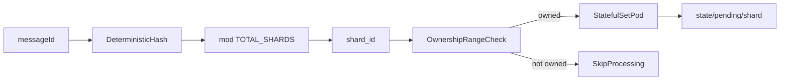

# SHARDING.md - Detailed Plan (Part 4)

This document defines the detailed sharding requirements for the SMS retry scheduler.
It extends the requirements in `PLAN.md` and `SYSTEM_OVERVIEW.md` and focuses only on shard assignment, worker ownership, contention avoidance, and sharding operations.

## 1) Scope

In scope:
- Deterministic shard assignment from `messageId`
- StatefulSet worker ownership ranges
- No-contention guarantees
- Startup/bootstrap behavior for owned shards
- Scaling and reconfiguration constraints for sharding
- Shard-focused observability and validation criteria

Out of scope:
- API contract details outside shard routing context
- Retry timing logic details not directly related to shard ownership
- UI behavior

## 2) Core sharding model

### 2.1 Deterministic shard assignment

Each message is assigned a shard ID using:

`shard_id = hash(messageId) % TOTAL_SHARDS`

Requirements:
- The hash function must be deterministic and stable across runtime instances (for example, sha256-based integer mapping).
- The same `messageId` must always map to the same `shard_id` for a fixed `TOTAL_SHARDS`.
- `TOTAL_SHARDS` is a system-level configuration shared by all backend and worker instances.

### 2.2 Persistence namespace by shard

Pending messages are persisted under shard-specific prefixes:

- `state/pending/shard-<shard_id>/<messageId>.json`

Requirements:
- Ownership and processing are enforced at the prefix level.
- A worker only scans/processes pending objects for shard IDs in its owned range.
- Success/failed transitions preserve the original `messageId` while moving to terminal prefixes:
  - `state/success/<yyyy>/<MM>/<dd>/<hh>/<messageId>.json`
  - `state/failed/<yyyy>/<MM>/<dd>/<hh>/<messageId>.json`

## 3) Worker ownership model

Workers run as a Kubernetes StatefulSet (`worker-0`, `worker-1`, ...), with stable ordinals.

### 3.1 Ownership derivation

- `pod_index` is derived from `HOSTNAME`.
- Each pod owns a contiguous shard range:
  - `range(pod_index * shards_per_pod, (pod_index + 1) * shards_per_pod)`

Requirements:
- Ownership calculation must be deterministic and side-effect free.
- Ownership ranges must be non-overlapping.
- Every shard must be owned by exactly one active worker pod at a time (under valid configuration).

### 3.2 Ownership invariants

For any `shard_id`:
- Exactly one worker is owner.
- Only owner may execute pending-read/pending-write processing decisions for that shard.
- Non-owner workers must skip out-of-range shard data.

## 4) Contention avoidance and processing boundary

To prevent write contention and duplicated processing:

- The worker must check ownership before processing pending messages.
- Ownership checks apply in both:
  - startup/bootstrap scans
  - periodic wakeup processing
- If a worker encounters out-of-range pending data, it must skip and emit diagnostic metadata (log/metric).

Idempotency remains mandatory for safety, but shard ownership is the primary mechanism that minimizes concurrent contention.

## 5) Startup/bootstrap behavior for shard recovery

On startup, a worker must:

1. Compute owned shard range from `HOSTNAME` and `shards_per_pod`.
2. Scan only owned pending shard prefixes (`state/pending/shard-<shard_id>/`).
3. Reconstruct local due-work state from persisted `nextDueAt` using a priority structure ordered by earliest due time (Min-Heap semantics).
4. Resume processing using normal wakeup cadence.

Requirements:
- Recovery must not require global scans of all shards.
- Recovery must tolerate partial/corrupt pending objects:
  - skip invalid entries
  - log structured error context (`messageId` if present, `shard_id`, reason)
  - increment error metric

## 6) Scaling and reconfiguration constraints

### 6.1 Replica scaling

Changing worker replica count changes shard-to-pod ownership mapping.

Requirements:
- Ownership ranges must be recomputed deterministically after scale events.
- During transitions, idempotency must protect against duplicate side effects.
- Workers should only process shards they currently own according to current config.

### 6.2 TOTAL_SHARDS changes

Changing `TOTAL_SHARDS` alters shard mapping and is a migration event.

Requirements:
- Treat `TOTAL_SHARDS` changes as explicit operational migrations.
- Do not change dynamically in normal runtime without a migration plan.
- Migration planning must include data remapping/compatibility strategy.

## 7) Observability requirements (shard-focused)

Each worker should emit structured logs and metrics that include:
- `hostname`
- `pod_index`
- owned shard range
- `shard_id` for processing decisions
- counts per shard: scanned, due, processed, skipped(out-of-range), invalid

Minimum operational visibility:
- Current ownership map per worker
- Processing rate by shard
- Error/invalid-object counts by shard

## 8) Validation checklist

A sharding implementation is considered correct when:

1. Determinism
   - Same `messageId` always maps to the same `shard_id` for fixed `TOTAL_SHARDS`.
2. Ownership correctness
   - Ownership range math is consistent with StatefulSet ordinal.
   - No overlap between workers.
3. Processing boundary
   - Worker only processes owned shard prefixes.
4. Recovery correctness
   - Restarted worker can rebuild due-work state from owned prefixes.
5. Operational safety
   - Scale/restart events do not violate ownership invariants.
6. Observability
   - Logs/metrics are sufficient to diagnose shard assignment and ownership issues.

## 9) Conceptual sharding flow

