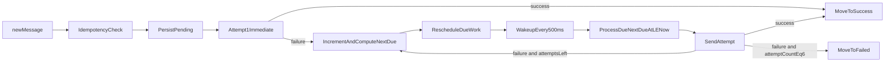

# CORE_LIFECYCLE.md - Detailed Plan (Section 5)

This document provides a detailed requirements-level plan for Section 5: core message lifecycle and retry behavior.

It is aligned with:
- `plans/PLAN.md`
- `plans/SYSTEM_OVERVIEW.md`
- `plans/SHARDING.md`
- `plans/NOTIFICATION_SERVICE.md`
- `plans/MOCK_SMS.md` (audit fields on `POST /send`)
- `plans/HEALTH_MONITOR.md` (optional **POST** integrity-check vs S3—does not change worker logic)

## 1) Scope

In scope:
- Message activation (`newMessage`) requirements
- Attempt #1 immediate execution behavior
- Retry state machine and retry timeline
- 500ms wakeup loop expectations
- State transitions between pending/success/failed
- Idempotency and failure handling requirements

Out of scope:
- UI behavior
- Kubernetes deployment details beyond lifecycle ownership boundaries
- Shard ownership formula details (covered in `plans/SHARDING.md`)

## 2) Lifecycle states and canonical transitions

### 2.1 Canonical states

Each message has one lifecycle state:
- `pending`
- `success`
- `failed`

### 2.2 Transition rules

- `pending -> success`
  - When a send attempt succeeds.
- `pending -> failed`
  - When retry threshold is exhausted (attemptCount reaches terminal value).
- No transition out of terminal states (`success`/`failed`).

## 3) Message activation (`newMessage`) requirements

All lifecycle persistence reads/writes in this section are performed through the dedicated S3 persistence service (no direct S3 client calls from API/worker).

When a message enters processing flow:

1. **Idempotency check**
   - Verify whether the `messageId` is already known in local cache and/or persistence.
   - Do not duplicate side effects for already-terminal messages.

2. **Durable pending persistence**
   - API creates the pending object first under:
     - `state/pending/shard-<shard_id>/<messageId>.json`
   - Worker activation (HTTP **activate-pending** or **`activate-pending-batch`**) may **enqueue** the row into the worker’s due-work structure and **wake** the scheduler; **`run_tick`** / **`handle_one`** still load and validate the persisted object before attempt #1 (same path as discovery-only).

3. **Immediate first attempt**
   - Attempt #1 must execute with 0s delay.
   - Attempt #1 corresponds to `attemptCount=0`.

4. **On failure of attempt #1**
   - Increment `attemptCount`
   - Compute new `nextDueAt` based on retry timeline
   - Persist updated pending state
   - Add/reschedule message in due-work priority structure

## 4) Retry timeline and scheduling requirements

### 4.1 Required retry timeline

Relative delay after each failed attempt:
- Attempt #2: +0.5s
- Attempt #3: +2s
- Attempt #4: +4s
- Attempt #5: +8s
- Attempt #6: +16s

### 4.2 Terminal threshold

- `attemptCount` range is `0..6`.
- When threshold is reached (`attemptCount == 6`), transition to terminal failed state and stop retries.

### 4.3 Wakeup loop behavior

- Scheduler wakeup cadence must run at an exact 500ms tick.
- On each tick, process all due messages where:
  - `nextDueAt <= now`
- Due selection/release ordering must be driven by earliest `nextDueAt` first (priority semantics / Min-Heap-compatible behavior).
- Due sends in each tick execute concurrently (equivalent concurrency semantics to `asyncio.gather`).

### 4.4 Concurrent due processing

- Due messages in a tick should be processed concurrently to support high throughput.
- Concurrency must preserve idempotent side effects and terminal-state correctness.

## 5) Persistence contract for lifecycle

### 5.1 Required pending payload fields

Pending object includes:
- `messageId`
- `attemptCount`
- `nextDueAt` (epoch ms, UTC instant)
- `status` — **must** be **`pending`** for every object while it remains under `state/pending/shard-<shard_id>/` ([`PLAN.md`](PLAN.md) §3). Mismatch (e.g. `success` in a pending key) is **invalid**; treat per resilience rules ([`TEST_LIST.md`](TEST_LIST.md) **TC-RQ-12**).
- `payload` (`to`, `body`)
- `history` (optional)

Terminal object bodies (after move) **must** set **`status`** to **`success`** or **`failed`** to match the terminal prefix.

### 5.2 Required key transitions

- Pending key:
  - `state/pending/shard-<shard_id>/<messageId>.json`
- Success key:
  - `state/success/<yyyy>/<MM>/<dd>/<hh>/<messageId>.json`
- Failed key:
  - `state/failed/<yyyy>/<MM>/<dd>/<hh>/<messageId>.json`

Path segments **`yyyy` / `MM` / `dd` / `hh`** are computed from the **UTC** time of the terminal write (same **`now`** source as the transition decision), **24-hour** hour, zero-padded—[`PLAN.md`](PLAN.md) §3.

After success/failed transition:
- Message must no longer be eligible under pending processing.

### 5.3 Terminal outcome notification (required)

After a **durable** terminal write to `state/success/...` or `state/failed/...`, the worker **must publish** a terminal-outcome event to the **outcomes notification service** ([`NOTIFICATION_SERVICE.md`](NOTIFICATION_SERVICE.md)) so `GET /messages/success` / `GET /messages/failed` can stay off broad terminal-prefix listing.

- **Order:** S3 terminal object committed **first**, then **notify** (retry notify on transient failures; see notification service doc).
- **Content:** at minimum `messageId`, `outcome` (`success` | `failed`), `recordedAt`, `notificationId`; align with the durable `state/notifications/...` record.
- **Downstream:** the notification service persists that record and updates **`OutcomesHotStore`** hot streams ([`NOTIFICATION_SERVICE.md`](NOTIFICATION_SERVICE.md) §3.1, §4–§5); workers do **not** talk to Redis or the hot store.

## 6) Failure handling and safety constraints

### 6.1 Mock SMS integration expectations

Worker send behavior must align with mock SMS contract:
- Endpoint: `POST /send`
- Success indication: HTTP **`2xx`**
- Simulated send failure: HTTP **`5xx`** (includes **failed-to-send** vs **service-unavailable** flavors; worker treats any **`5xx`** as a failed send for retry purposes)
- `shouldFail=true` should always yield **`5xx`**
- Otherwise the mock applies its module-level **`FAILURE_RATE`** (intermittent **`2xx`** vs **`5xx`**)
- **Integrity (recommended):** include **`messageId`** and **`attemptIndex`** (e.g. current `attemptCount`) on each `POST /send` so the mock’s **audit log** ([`MOCK_SMS.md`](MOCK_SMS.md) §8) can be validated against the retry timeline in tests and in production-like deployments.

### 6.2 Idempotency requirements

- Duplicate deliveries/replays/restarts must not produce duplicate terminal side effects for the same `messageId`.
- Retry updates must be monotonic and persistence-backed.

### 6.3 Recovery behavior

On worker startup/restart:
- Reconstruct due-work from owned pending keys and persisted `nextDueAt`.
- Continue from persisted lifecycle state without dropping eligible retries.

## 7) Observability requirements for lifecycle

Each lifecycle event should include structured fields:
- `messageId`
- `shard_id`
- `attemptCount`
- `status_before`
- `status_after`
- `nextDueAt`
- `outcome` (`success`/`retry`/`failed_terminal`)

Minimum counters:
- attempts started
- retries scheduled
- successful terminal transitions
- failed terminal transitions
- invalid/malformed pending records skipped

## 8) Validation checklist

The lifecycle implementation is valid when:

1. `newMessage` runs attempt #1 immediately (0s).
2. Failed attempts schedule exactly according to timeline.
3. Wakeup loop processes all due (`nextDueAt <= now`) messages.
4. Terminal threshold at `attemptCount == 6` is enforced.
5. Success/failed transitions remove pending eligibility; terminal S3 paths use **UTC** segments per [`PLAN.md`](PLAN.md) §3.
6. Pending keys always carry **`status: pending`**; terminal bodies **`success`** / **`failed`** per [`PLAN.md`](PLAN.md) §3.
7. Restarted worker can continue retries from persisted pending data.
8. Duplicate processing does not create duplicate terminal side effects.
9. After each terminal S3 transition, the notification service receives a publish (or is eventually consistent per retry policy in [`NOTIFICATION_SERVICE.md`](NOTIFICATION_SERVICE.md)).
10. Worker→mock `POST /send` calls include **`messageId`** (and preferably **`attemptIndex`**) so **mock SMS audit** validation can confirm sends match the planned schedule ([`MOCK_SMS.md`](MOCK_SMS.md) §8).
11. **Health monitor** (separate container) validates audit vs S3 **on demand** via **`POST`**—see [`HEALTH_MONITOR.md`](HEALTH_MONITOR.md) §4; it does **not** replace lifecycle tests ([`TEST_LIST.md`](TEST_LIST.md) **TC-RT-03**).

## 9) Conceptual lifecycle flow

**Diagram note (normative interpretation):** match [`TEST_LIST.md`](TEST_LIST.md) **TC-RT-03** and [`HEALTH_MONITOR.md`](HEALTH_MONITOR.md) §3.4: **six** failed sends with **`attemptIndex` 0..5** at send time, then **`attemptCount == 6`** and **terminal failed** with **no seventh** scheduled retry. The edge label `attemptCountEq6` abbreviates “failure path once terminal threshold is reached per §4.2”; implementers must not schedule an extra send inconsistent with **TC-RT-03**.

