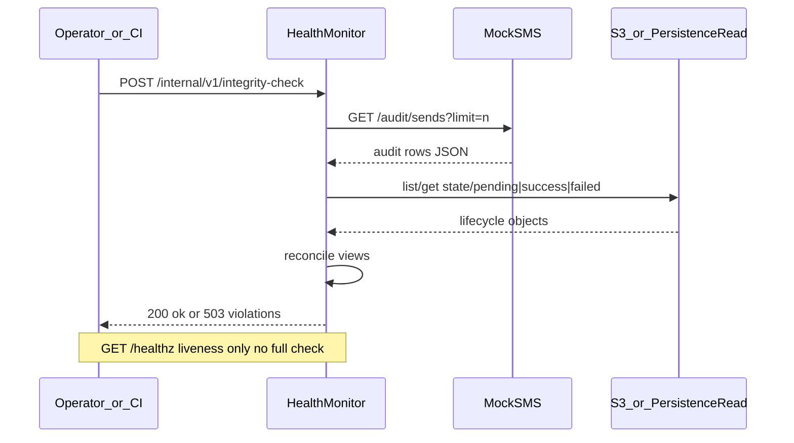

# HEALTH_MONITOR.md - SMS / S3 integrity health monitor (dedicated container)

Aligned with [`plans/PLAN.md`](PLAN.md) §9, [`plans/SYSTEM_OVERVIEW.md`](SYSTEM_OVERVIEW.md), [`plans/MOCK_SMS.md`](MOCK_SMS.md) §8, [`plans/CORE_LIFECYCLE.md`](CORE_LIFECYCLE.md), and [`plans/SHARDING.md`](SHARDING.md).

## 1) Purpose

Provide a **non-hot-path** **health monitor** service (its **own container**) that **compares** the mock SMS send audit to **S3**, the **source of truth** for message lifecycle (`pending` / `success` / `failed`).

**Production / exercise norm:** the **expensive reconciliation** (read mock audit + read S3 + evaluate invariants) runs **only when explicitly requested** via a **REST API** on the health monitor itself—not on a background timer. That avoids continuous load on S3 and the mock and keeps orchestrator **liveness** probes cheap.

Goals:

- **Detect drift:** phantom sends (audit without plausible S3 story), missing sends (S3 implies attempts the mock never saw), or inconsistent terminal outcomes vs recorded HTTP results.
- **On-demand:** operators, CI, or the main API (internal call) trigger a check when needed.

The monitor **does not** change worker behavior, **does not** call the public REST API for outcomes, and **must not** write lifecycle keys (read-only toward `state/pending/`, `state/success/`, `state/failed/`).

## 2) Inputs

### 2.1 Mock SMS audit (“the log”)

When a check is **triggered** (§4), the monitor **fetches** audit data:

**Preferred:** call **`GET /audit/sends?limit=<n>`** on the mock SMS service ([`MOCK_SMS.md`](MOCK_SMS.md) §8.2), with `n` capped by the mock’s server maximum. For a **single** on-demand run you may request the **maximum** allowed window (or paginate if you add a `since=` query later—optional extension).

**Alternative:** if **`EXPOSE_AUDIT_ENDPOINT`** is `False`, supply audit input from **stdout JSONL** / file / log pipeline in **test harnesses only**; production-like stacks should keep **`EXPOSE_AUDIT_ENDPOINT=True`** on the mock so the monitor can call HTTP.

### 2.2 S3 (source of truth)

On each triggered run, the monitor **reads** the same key layout as the rest of the system ([`PLAN.md`](PLAN.md) §3). When listing terminal prefixes, use **UTC** partition segments consistent with writers (§3 **UTC** rule)—do not mix local timezone paths.

- `state/pending/shard-<shard_id>/<messageId>.json` — JSON **`status`** **must** be **`pending`** if valid ([`PLAN.md`](PLAN.md) §3).
- `state/success/<yyyy>/<MM>/<dd>/<hh>/<messageId>.json`
- `state/failed/<yyyy>/<MM>/<dd>/<hh>/<messageId>.json`

**Access pattern (choose one and document in implementation):**

1. **Preferred:** read-only calls through the **persistence service** (internal HTTP or library) if it exposes **`list_prefix` / `get_object`** for these prefixes—keeps a single S3 integration point.
2. **Acceptable for local/compose:** **read-only** `aioboto3` (or equivalent) against the **same bucket/endpoint** as persistence, using credentials scoped to **GetObject** + **ListBucket** on `state/*` only.

**Persistence boundary note:** [`SYSTEM_OVERVIEW.md`](SYSTEM_OVERVIEW.md) requires API/workers to use the persistence service for S3. The **health monitor** is an explicit **exception** for **read-only** lifecycle inspection (this section), so it does **not** violate the “no ad-hoc writer” rule; avoid granting it **write** IAM beyond what is strictly necessary (ideally **none** on lifecycle prefixes).

Do **not** list unbounded `state/notifications/...` during a check unless you explicitly extend the spec; reconciliation is **lifecycle vs mock sends**, not recent-outcomes cache.

## 3) Reconciliation model

### 3.1 When it runs

- **Normative (production / deployed exercise):** reconciliation executes **only** inside the handler for the **on-demand REST endpoint** (§4.2)—**no** periodic loop by default.
- **Optional dev flag:** **`ENABLE_PERIODIC_RECONCILE`** env (default **`false`**). If set **`true`** for local demos only, an interval (e.g. **`HEALTH_MONITOR_POLL_INTERVAL_SEC`**) may run background checks—**must stay off** in “production-like” exercise deployments so behavior matches §4.2.

### 3.2 Build views

- **Audit view:** multiset or ordered list of rows per **`messageId`** (ignore rows with `messageId == null` for *per-message* rules, or bucket them under “anonymous” diagnostics only).
- **S3 view:** for each `messageId` of interest, classify as **pending**, **terminal success**, or **terminal failed**, and read **`attemptCount`** (and optional **`history`**) from the JSON body when present.

### 3.3 Minimum invariant set (normative baseline)

These must hold when evaluated on a **triggered** run (allow a short **lag** constant in the request body or env, e.g. “ignore pendings with `nextDueAt` within **X** ms of now” to reduce race flakiness):

1. **Terminal success:** if `messageId` exists under `state/success/...`, there must be **at least one** audit row for that `messageId` with **`http_status` in 2xx** and `outcome_kind` consistent with success ([`MOCK_SMS.md`](MOCK_SMS.md) §8.1).
2. **Terminal failed:** if `messageId` exists under `state/failed/...`, the persisted record must reflect **terminal failure** per [`PLAN.md`](PLAN.md) §5 (`attemptCount == 6`), and the audit trail must show **only `5xx`** outcomes for sends that align with that terminal path (see §3.4 for counting when `attemptIndex` is present vs absent).
3. **No duplicate terminals:** same `messageId` must not appear in both **success** and **failed** prefixes.

### 3.4 Stronger checks (recommended when worker sends `attemptIndex`)

If workers pass **`attemptIndex`** on each `POST /send` ([`MOCK_SMS.md`](MOCK_SMS.md) §3.1, [`CORE_LIFECYCLE.md`](CORE_LIFECYCLE.md) §6.1):

- For **terminal failed**, align with [`TEST_LIST.md`](TEST_LIST.md) **TC-RT-03** / [`CORE_LIFECYCLE.md`](CORE_LIFECYCLE.md) §4.2: **six** failed sends with **`attemptIndex` at send time** in **0..5** (then `attemptCount` becomes **6** and **no seventh** retry is scheduled). Require **exactly six** matching audit rows **or** exact equality derived from persisted **`history`** + final outcome—**document the chosen rule** in code/README so tests lock it. (If `attemptIndex` is omitted, fall back to weaker §3.3 checks only.)

If **`attemptIndex` is often null**, keep **Level 3.3** as the **CI gate** and treat exact counts as **best-effort** / warning severity only.

### 3.5 Pending messages

**In-flight** pending messages may legitimately **lag** the audit relative to S3; avoid flapping:

- Either **exclude** `messageId`s whose `nextDueAt` is in the **future** from strict “missing send” checks, or require **only** that **due** pendings eventually gain matching audit rows within a **`LIVENESS_GRACE_MS`** window **documented** on the check request or env.

## 4) REST API (required)

### 4.1 `GET /healthz` — liveness

- **Purpose:** process is up (for Kubernetes/docker **liveness** without triggering S3/mock work).
- **`200`:** monitor process healthy; **does not** run full reconciliation.
- **Optional JSON:** `{"status":"ok"}` — no dependency on mock/S3 for this endpoint (or document if you ping mock with a **cheap** `GET` only—prefer **no** I/O here).

### 4.2 On-demand integrity check (normative trigger)

- **Method/path (suggested):** **`POST /internal/v1/integrity-check`** (private network). Alternative: **`POST /v1/check`**—pick one and document in OpenAPI/README.
- **Behavior:** perform **one** full reconciliation (§2 → §3). Optionally accept JSON body: `{ "graceMs": 500 }` for §3.5.
- **Success response:** **`200`** + JSON body, e.g. `{ "ok": true, "checkedAt": "...", "summary": { "violations": 0 } }`.
- **Failure response:** **`503`** (or **`422`**) + JSON listing **blocking** violations; same **fail-closed** default as before when mock/S3 unreachable during the check.
- **Auth:** shared secret header, mTLS, or **network policy** (allow only API/CI/admin)—**document** for the exercise.

### 4.3 Optional: last result cache

- After **`POST .../integrity-check`**, the monitor **may** store the **last result** in memory.
- **`GET /internal/v1/integrity-status`** (optional): returns **cached** last result **without** re-running S3/mock (for dashboards). If **never run**, **`404`** or `{ "lastRun": null }`—document.

### 4.4 Observability

- **Structured logs (stdout):** each **triggered** run: counts scanned, violations, latency.
- **Metrics (optional):** `health_monitor_reconcile_seconds`, `health_monitor_violations_total{kind}` (increment **per POST** run).

## 5) Deployment topology

- **Single replica** is enough for the exercise (no leader election).
- **Network:** must reach **mock SMS** and **S3** (or LocalStack) / **persistence read** endpoint **when a check is invoked**—not continuously.
- **Secrets:** read-only AWS creds or internal service token; optional **`INTEGRITY_CHECK_TOKEN`** for POST; **never** reuse worker write credentials if that implies write scope.

## 6) Non-goals

- **Not** a substitute for **unit/E2E** tests ([`TESTS.md`](TESTS.md), [`TEST_LIST.md`](TEST_LIST.md)).
- **Not** responsible for **Redis** or **notification service** correctness (covered elsewhere).
- **Not** required to scale to tens-of-thousands of checks per second; each **POST** may do **O(n)** scans over **bounded** audit windows and **prefix listings**—callers should **rate-limit** externally if needed.

## 7) Validation checklist

The health monitor spec is satisfied when:

1. Container runs **independently** of workers and **never** mutates lifecycle S3 keys.
2. **By default** (`ENABLE_PERIODIC_RECONCILE` unset/false), **no** background reconciliation loop runs.
3. **`POST`** on the documented **integrity-check** path **ingests** mock audit and **reads** S3 (or persistence read API) per §2 and applies §3.
4. **`GET /healthz`** remains **liveness-only** (§4.1) and does **not** perform full reconciliation on every probe.
5. **docker-compose** (or README) documents **env vars**: mock base URL, S3/persistence connectivity, optional **`ENABLE_PERIODIC_RECONCILE`**, optional grace, and **POST** auth.

## 8) Conceptual flow

