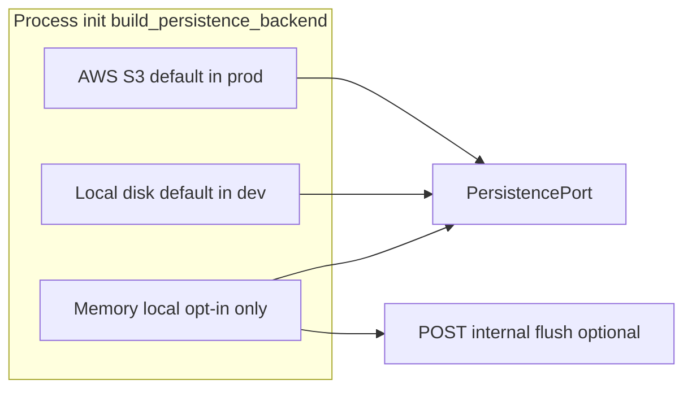

# Plan: In-memory local persistence (opt-in dev/test backend)

Canonical persistence contract remains [`LOCAL_S3.md`](LOCAL_S3.md) and [`PersistencePort`](../src/inspectio_exercise/persistence/interface.py). This document plans an **additional** backend implementation and wiring.

## 1) Defaults and when each backend is used

**No change to today’s default matrix** except adding an **explicit opt-in** for memory.

| Environment | Default persistence | How it is selected (same as today) |
|-------------|--------------------|-------------------------------------|
| **Production** | **AWS S3** | `INSPECTIO_PERSISTENCE_BACKEND=aws` and/or bucket env (`INSPECTIO_S3_BUCKET` / `S3_BUCKET`) with no competing local root — see [`backend.py`](../src/inspectio_exercise/persistence/backend.py) `_resolve_backend_mode()`. |
| **Local dev / compose** | **Local disk** file tree under `LOCAL_S3_ROOT` | `INSPECTIO_PERSISTENCE_BACKEND=local` and/or `LOCAL_S3_ROOT` set — current `LocalS3Provider`. |

**In-memory backend:** used **only on demand at process init** when an operator **explicitly** sets a dedicated env var (e.g. `INSPECTIO_LOCAL_S3_STORAGE=memory`). It is **never** chosen implicitly from “missing” vars, **never** the default for dev or prod, and **never** auto-enabled in `docker-compose.yml` unless we deliberately add it for a specific profile later.

**Concrete rule:** `build_persistence_backend()` selects `MemoryLocalS3Provider` **if and only if** local mode is already selected **and** the opt-in flag requests memory. Otherwise file-backed `LocalS3Provider` or `AwsS3Provider` as today.

Suggested env shape (final names can match existing `config.py` style):

- `INSPECTIO_LOCAL_S3_STORAGE=file` — default when omitted; file-backed local provider.
- `INSPECTIO_LOCAL_S3_STORAGE=memory` — in-process dict backend (only valid together with local persistence selection).

Invalid combinations (return `None` / 503 as today): `memory` with AWS mode, or unknown token.

## 2) Goals

- **Speed:** `list_prefix` is **O(k)** over keys in memory (filter + sort), avoiding full filesystem `rglob` per call — see [`local_s3.py`](../src/inspectio_exercise/persistence/local_s3.py) `_list_prefix_sync`.
- **Same HTTP and contract:** All services keep using the persistence microservice; **`PersistencePort`** semantics match [`LOCAL_S3.md`](LOCAL_S3.md) §2–§4.
- **Optional disk snapshot:** Internal HTTP route (or equivalent) to **flush** in-memory state to a directory using the same **`root / key`** layout as the file provider for debugging and scripts that inspect `.local-s3/`.

## 3) Design

### 3.1 `MemoryLocalS3Provider`

- **New module:** e.g. [`src/inspectio_exercise/persistence/memory_s3.py`](../src/inspectio_exercise/persistence/memory_s3.py).
- **State:** `dict[str, bytes]`.
- **Locking:** `asyncio.Lock` around reads/writes/lists for consistency under concurrent FastAPI handlers.
- **Validation:** Reuse [`key_policy`](../src/inspectio_exercise/persistence/key_policy.py) like [`LocalS3Provider`](../src/inspectio_exercise/persistence/local_s3.py).
- **Async:** Pure async (no `to_thread`) — I/O is in-memory.
- **Flush (class-specific, not on `PersistencePort`):** `async def flush_to_disk(self, root: Path) -> None` — write every key to `root / key` with parent `mkdir`, same bytes-on-disk rule as §3 of [`LOCAL_S3.md`](LOCAL_S3.md).

### 3.2 Factory

- **Files:** [`config.py`](../src/inspectio_exercise/persistence/config.py) (new env constant + allowed values), [`backend.py`](../src/inspectio_exercise/persistence/backend.py).
- **Logic:** After resolving **local** mode: if opt-in says **memory**, return `MemoryLocalS3Provider()`; else require `LOCAL_S3_ROOT` and return `LocalS3Provider(Path(root))`.
- **`LOCAL_S3_ROOT` with memory:** Optional at startup; use as **default root** for flush HTTP body when unset, or require path in flush request — pick one and document (recommend: flush endpoint accepts optional override path; if both unset, 422).

### 3.3 Persistence HTTP

- **File:** [`app.py`](../src/inspectio_exercise/persistence/app.py).
- **Route:** e.g. `POST /internal/v1/flush-to-disk`, `include_in_schema=False`, dev/test oriented.
- **Behavior:** If backend is `MemoryLocalS3Provider`, run `flush_to_disk`; else respond with **501** or **404** + clear JSON (no silent no-op).

## 4) Documentation touchpoints

- This file (plan).
- [`LOCAL_S3.md`](LOCAL_S3.md) §5–§6: document opt-in env, memory vs file, flush route, and that memory is **volatile** across restarts.

## 5) Testing

- **Unit:** [`tests/unit/test_memory_s3_provider.py`](../tests/unit/test_memory_s3_provider.py) — mirror behavioral cases from [`test_local_s3_provider.py`](../tests/unit/test_local_s3_provider.py) where assertions are not disk-specific; add flush-to-tmp_path tests.
- **Factory:** [`test_persistence_backend_factory.py`](../tests/unit/test_persistence_backend_factory.py) — explicit `memory` opt-in selects memory provider; omitted flag + `LOCAL_S3_ROOT` stays file; prod/AWS path unchanged.
- **Integration:** [`test_persistence_service.py`](../tests/integration/test_persistence_service.py) — memory backend + flush + assert file on disk.

## 6) Non-goals (v1)

- Auto-flush timers, SIGUSR1, WAL.
- Changing **default** compose or prod images to memory.
- Cross-process shared memory.

## 7) Implementation checklist

1. [x] Add `MemoryLocalS3Provider` + `flush_to_disk` ([`memory_s3.py`](../src/inspectio_exercise/persistence/memory_s3.py)).
2. [x] Add `INSPECTIO_LOCAL_S3_STORAGE` in [`config.py`](../src/inspectio_exercise/persistence/config.py); branch in [`backend.py`](../src/inspectio_exercise/persistence/backend.py) with **opt-in only** semantics above (including AWS + memory → `None`).
3. [x] Add internal flush route `POST /internal/v1/flush-to-disk` in [`app.py`](../src/inspectio_exercise/persistence/app.py) (`include_in_schema=False`; **501** when backend is not memory; **422** when root missing from body and env).
4. [x] Tests ([`test_memory_s3_provider.py`](../tests/unit/test_memory_s3_provider.py), factory, integration flush) + ruff; link this plan from [`LOCAL_S3.md`](LOCAL_S3.md) §5–§6.

## 8) Verification

- Full `pytest` + `ruff check` / `ruff format` on touched paths.
