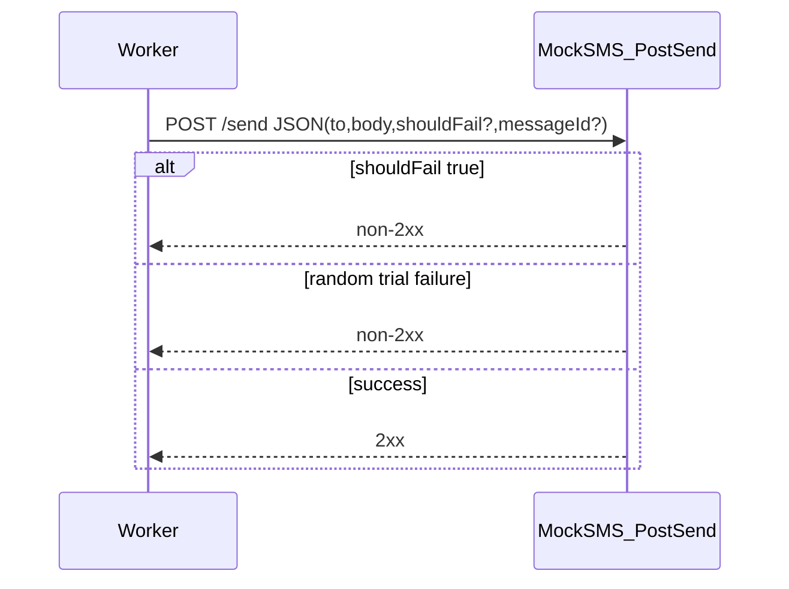

# MOCK_SMS.md - Detailed Plan (Section 8)

This document expands **Section 8** of [`plans/PLAN.md`](PLAN.md): the **mock SMS provider** (separate container). It aligns with [`plans/SYSTEM_OVERVIEW.md`](SYSTEM_OVERVIEW.md) and [`plans/CORE_LIFECYCLE.md`](CORE_LIFECYCLE.md).

## 1) Purpose and scope

**Purpose:**
- Simulate an external SMS gateway so workers can exercise **retry**, **backoff**, and **terminal failure** paths under load without a real provider.

**In scope:**
- HTTP contract for `POST /send`
- **Intermittent** (probabilistic) failure behavior plus explicit test hooks
- Configuration (failure rate, optional seed, optional latency)
- Success/failure signaling compatible with worker expectations
- Container/run expectations and minimal observability

**Out of scope:**
- Worker scheduler logic, S3 layout, API surface (covered elsewhere)
- Real provider integrations (Twilio, SNS, etc.)

## 2) Deployment model

- **Single small service** in its **own container** (one replica is enough for the exercise; scale only if you need HA for demos).
- Workers call it over HTTP using a **base URL** from configuration (e.g. `MOCK_SMS_URL=http://mock-sms:8080`).
- No shared state with workers; the mock may be **stateless** except for optional in-memory RNG state.

## 3) Endpoint: `POST /send`

### 3.1 Request body (JSON)

| Field          | Type    | Required | Description |
|----------------|---------|----------|-------------|
| `to`           | string  | yes      | Destination (opaque for the mock). |
| `body`         | string  | yes      | Message body (opaque for the mock). |
| `shouldFail`   | boolean | no       | If `true`, request **must** fail (deterministic), regardless of intermittent rate. |
| `messageId`    | string  | no       | Optional pass-through for logs/tracing (worker may include it). |

Validation:
- Reject missing `to` or `body` with **4xx** (e.g. `400`) and a small JSON error body.
- Ignore unknown fields or reject with **400**—pick one and document in implementation (prefer **ignore** for forward compatibility in exercises).

### 3.2 Success response

- **2xx** status (e.g. `200 OK` or `204 No Content`).
- Optional JSON body, e.g. `{ "ok": true }`—must not be required for workers to treat as success.

### 3.3 Failure response

- **Non-2xx** HTTP status (per architect requirement so workers treat as send failure).
- Recommended: **`503 Service Unavailable`** or **`502 Bad Gateway`** to resemble transient provider errors; **`500`** is acceptable.
- Optional JSON body: `{ "error": "...", "code": "SEND_FAILED" }` for debugging.

Workers **must not** depend on a specific failure status code—only on **non-2xx**.

## 4) Intermittent failure behavior (core requirement)

**Goal:** Without `shouldFail`, a non-trivial fraction of requests **randomly** fail so that, under load, **some messages fail and later succeed on retry** (and some eventually **fail terminally** after the lifecycle cap).

### 4.1 Default semantics

1. If `shouldFail === true` → **always** respond with failure (non-2xx).
2. Else:
   - With probability **`failure_rate`** (configurable, see §5), return failure.
   - With probability **`1 - failure_rate`**, return success.

Each request is an **independent** trial unless a **deterministic mode** is enabled (§4.3). This yields **intermittent**, provider-like unreliability.

### 4.2 Suggested default `failure_rate`

- **Exercise default:** e.g. **`0.15`–`0.30`** (15%–30%) so retries and load tests show mixed outcomes without starving successes.
- Exact default must be **documented** and **overridable** via environment variable.

### 4.3 Determinism for tests

Optional but recommended for CI/reproducibility:

- **`MOCK_SMS_SEED`**: if set (integer), initialize RNG so the same sequence of outcomes repeats for a given order of requests (same process).
- **`shouldFail`** remains the **highest-priority** override (always fail when true).

Document clearly that multi-worker or concurrent tests may interleave requests, which changes ordering vs single-threaded replay.

### 4.4 No “sticky” failure per `messageId` (unless explicitly added)

- Baseline spec: **do not** require per-`messageId` failure memory; intermittent behavior is **per request**.
- Optional extension (not required): “poison” IDs that always fail—only if you need it for targeted demos.

## 5) Configuration (environment variables)

| Variable | Meaning | Example |
|----------|---------|---------|
| `MOCK_SMS_FAILURE_RATE` | Probability of failure when `shouldFail` is not true; `0.0`–`1.0`. | `0.2` |
| `MOCK_SMS_SEED` | Optional RNG seed for reproducible intermittent sequences. | `42` |
| `MOCK_SMS_PORT` / `PORT` | Listen port inside container. | `8080` |
| `MOCK_SMS_LATENCY_MS` | Optional injected delay before processing (§6). | `0` or `50` |

Invalid `MOCK_SMS_FAILURE_RATE` (NaN, negative, >1) → fail fast at startup with a clear error log.

## 6) Optional latency / slow path

To simulate slow or flaky networks:

- **Fixed delay:** sleep `MOCK_SMS_LATENCY_MS` before evaluating success/failure.
- **Optional jitter:** e.g. uniform `0..JITTER_MS`—document if implemented.

Workers should already tolerate slow responses; keep defaults **low** so the **500ms wakeup** cadence remains meaningful in tests.

## 7) Health check (recommended)

Not mandated in `PLAN.md`, but useful for Docker/Kubernetes:

- `GET /healthz` → `200` when process is up.

## 8) Observability

Structured logs (stdout):

- Each `POST /send`: `messageId` (if present), outcome (`success`/`fail`/`forced_fail`), HTTP status returned, optional `failure_rate` effective at request time.
- Log level: avoid logging full `body` if it can be large; truncate or omit in production-like settings.

Metrics (optional for exercise):

- Counter: `mock_sms_requests_total{result}`
- Histogram: `mock_sms_latency_seconds`

## 9) Tech stack suggestion

- **FastAPI** + **uvicorn** (matches rest of exercise) or a minimal **aiohttp**/Starlette app.
- Single file or small module; Dockerfile **non-root** user if easy.

## 10) Validation checklist

The mock SMS plan is complete when:

1. `POST /send` validates required fields and returns **2xx** only on simulated success.
2. **`shouldFail=true`** always yields **non-2xx**.
3. With `shouldFail` absent/false, failures occur **intermittently** at approximately the configured **failure rate** over many requests.
4. Failures are visible to workers **only** via **non-2xx** (no special success body meaning “failed”).
5. Configuration for **failure rate** (and optional **seed**, **latency**) is documented and defaults are sensible for load tests.
6. Container runs isolated from workers and is reachable at a **configurable base URL**.

## 11) Conceptual flow

