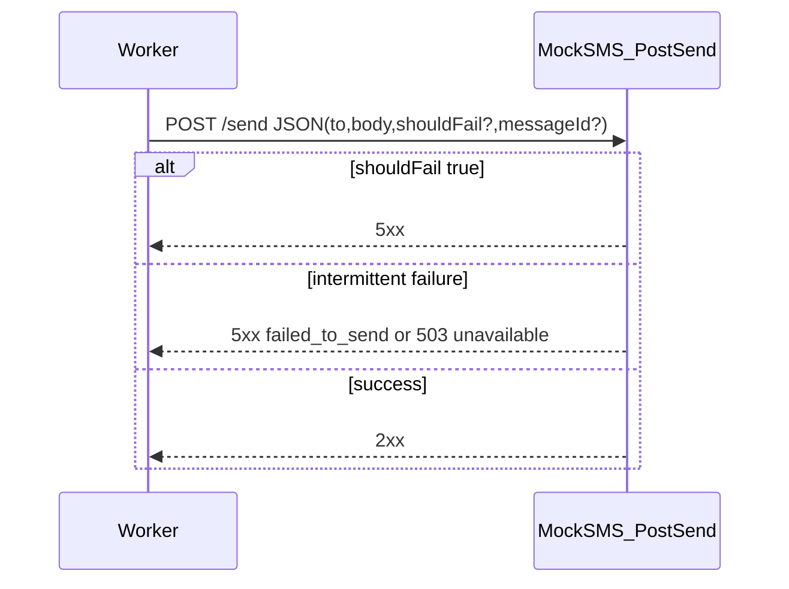

# MOCK_SMS.md - Detailed Plan (Section 8)

This document expands **Section 8** of [`plans/PLAN.md`](PLAN.md): the **mock SMS provider** (separate container). It aligns with [`plans/SYSTEM_OVERVIEW.md`](SYSTEM_OVERVIEW.md) and [`plans/CORE_LIFECYCLE.md`](CORE_LIFECYCLE.md).

## 1) Purpose and scope

**Purpose:**
- Simulate an external SMS gateway so workers can exercise **retry**, **backoff**, and **terminal failure** paths under load without a real provider.

**In scope:**
- HTTP contract for `POST /send`
- **Intermittent** (probabilistic) failure behavior plus explicit test hooks
- **Module-level constants** for all mock **behavior** parameters (failure rate, failure-kind mix, optional RNG seed, optional latency, listen port)
- Success/failure signaling compatible with worker expectations
- Container/run expectations and minimal observability

**Out of scope:**
- **Web UI** or runtime admin API for changing mock behavior (tune constants in source and redeploy).
- Worker scheduler logic, S3 layout, API surface (covered elsewhere)
- Real provider integrations (Twilio, SNS, etc.)

## 2) Deployment model

- **Single small service** in its **own container** (one replica is enough for the exercise; scale only if you need HA for demos).
- Workers call it over HTTP using a **base URL** from **worker** configuration (e.g. env on the worker side only: `MOCK_SMS_URL=http://mock-sms:8080`). The **mock service itself** does not read env vars for behavior—only **module constants** (see §5).
- No shared state with workers; the mock may be **stateless** except for optional in-memory RNG state.

## 3) Endpoint: `POST /send`

### 3.1 Request body (JSON)

| Field          | Type    | Required | Description |
|----------------|---------|----------|-------------|
| `to`           | string  | yes      | Destination (opaque for the mock). |
| `body`         | string  | yes      | Message body (opaque for the mock). |
| `shouldFail`   | boolean | no       | If `true`, request **must** fail (deterministic), regardless of intermittent rate. |
| `messageId`    | string  | no       | Optional pass-through for logs/tracing (worker may include it). |

Validation:
- Reject missing `to` or `body` with **4xx** (e.g. `400`) and a small JSON error body.
  - **Note:** **4xx** is reserved for **bad requests to the mock itself** (schema/validation). It is **not** used for simulated SMS outcomes once the request is accepted for processing.

### 3.2 Success response (simulated send succeeded)

- **`2xx`** only (e.g. `200 OK` or `204 No Content`).
- Optional JSON body, e.g. `{ "ok": true }`—must not be required for workers to treat as success.

### 3.3 Failure responses (simulated SMS did not succeed)

For **simulated send outcomes**, the mock uses **only `2xx` (success) or `5xx` (failure)**—no **`4xx`** on the happy validation path.

Two **failure kinds** (both returned as **`5xx`**) so workers can optionally distinguish logging/metrics while still treating any **`5xx`** as a failed send for lifecycle/retry purposes:

| Failure kind | Meaning (examples) | Suggested HTTP | Optional JSON `code` |
|--------------|-------------------|----------------|------------------------|
| **Failed to send** | Provider accepted the call but could not deliver: invalid recipient, line error, upstream rejection, etc. | **`500 Internal Server Error`** or **`502 Bad Gateway`** | e.g. `FAILED_TO_SEND` |
| **Service unavailable** | Transient outage / overload: circuit open, throttling, gateway timeout | **`503 Service Unavailable`** | e.g. `SERVICE_UNAVAILABLE` |

Optional JSON body (either kind): `{ "error": "human readable", "code": "<machine code>" }` for debugging.

**Worker contract:**
- Treat **any `5xx`** from `POST /send` as a **failed send** (retry per lifecycle rules).
- **Must not** depend on **which** `5xx` or **`code`** for correctness—only for observability; **`shouldFail`** and intermittent logic may pick either failure kind.

## 4) Intermittent failure behavior (core requirement)

**Goal:** Without `shouldFail`, a non-trivial fraction of requests **randomly** fail so that, under load, **some messages fail and later succeed on retry** (and some eventually **fail terminally** after the lifecycle cap).

### 4.1 Default semantics

1. If `shouldFail === true` → **always** respond with a **`5xx`** (implementation may alternate or fix a kind; see §4.2).
2. Else:
   - With probability **`FAILURE_RATE`** (module constant, see §5), return a **`5xx`**.
   - With probability **`1 - FAILURE_RATE`**, return **`2xx`**.

When returning a simulated failure **`5xx`**, pick **which kind** (**failed-to-send** vs **service unavailable**) using a second draw (§4.2).

Each request is an **independent** trial unless a **deterministic RNG seed** is set (§4.4). This yields **intermittent**, provider-like unreliability.

### 4.2 Mix of failure kinds (configurable split via constant)

When a request is chosen to **fail** (intermittent or `shouldFail`):

- With probability **`UNAVAILABLE_FRACTION`** (module constant, default suggestion **`0.5`**) return **`503`** with `code: SERVICE_UNAVAILABLE` (or equivalent).
- Otherwise return **`500`** or **`502`** with `code: FAILED_TO_SEND` (or equivalent).

This ensures load tests see **both** “hard” send failures and transient unavailability-style failures, all still **`5xx`**.

### 4.3 Suggested default `FAILURE_RATE`

- **Exercise default:** e.g. **`0.15`–`0.30`** (15%–30%) so retries and load tests show mixed outcomes without starving successes.
- **`FAILURE_RATE`** is a **module constant**; document the chosen value in code comments next to the constant.

### 4.4 Determinism for tests

Optional but recommended for CI/reproducibility:

- **`RNG_SEED`**: module-level constant; if set to an `int`, initialize the RNG so the same sequence of outcomes repeats for a given order of requests (same process). Use `None` (or omit) for non-deterministic behavior.
- **`shouldFail`** remains the **highest-priority** override (always fail when true).

Document clearly that multi-worker or concurrent tests may interleave requests, which changes ordering vs single-threaded replay.

### 4.5 No “sticky” failure per `messageId` (unless explicitly added)

- Baseline spec: **do not** require per-`messageId` failure memory; intermittent behavior is **per request**.
- Optional extension (not required): “poison” IDs that always fail—only if you need it for targeted demos.

## 5) Behavior parameters (module constants)

Define **all** mock **behavior** tuning as **named constants at the top of the mock’s Python module** (or a dedicated `config.py` imported by the app). **Do not** read OS environment variables for these values. **No web UI** to change them at runtime.

| Constant | Meaning | Example / suggestion |
|----------|---------|---------------------|
| `FAILURE_RATE` | Probability of **`5xx`** when `shouldFail` is not true; must satisfy `0.0 <= FAILURE_RATE <= 1.0`. | `0.2` |
| `UNAVAILABLE_FRACTION` | Of simulated **`5xx`** outcomes, fraction that are **service unavailable** (`503`); remainder are **failed-to-send** (`500`/`502`). `0.0`–`1.0`. | `0.5` |
| `RNG_SEED` | Optional `int` for reproducible intermittent sequences; `None` for non-deterministic. | `42` or `None` |
| `LISTEN_PORT` | TCP port the mock binds to (still a constant in module; Dockerfile/`uvicorn` CLI should match). | `8080` |
| `LATENCY_MS` | Milliseconds to sleep before evaluating success/failure (§6); use `0` to disable. | `0` or `50` |

Requirements:
- Validate ranges at **import/startup** (e.g. assert or explicit check): invalid `FAILURE_RATE` / `UNAVAILABLE_FRACTION` → **fail fast** with a clear error before serving traffic.
- Changing behavior = **edit constants** and **rebuild/redeploy** the container.

## 6) Optional latency / slow path

To simulate slow or flaky networks:

- **Fixed delay:** sleep **`LATENCY_MS`** (module constant) before evaluating success/failure.
- **Optional jitter:** e.g. uniform `0..JITTER_MS`—document if implemented.

Workers should already tolerate slow responses; keep defaults **low** so the **500ms wakeup** cadence remains meaningful in tests.

## 7) Health check (recommended)

Not mandated in `PLAN.md`, but useful for Docker/Kubernetes:

- `GET /healthz` → `200` when process is up.

## 8) Observability

Structured logs (stdout):

- Each `POST /send`: `messageId` (if present), outcome (`success` / `failed_to_send` / `service_unavailable` / `forced_fail`), HTTP status returned, effective `FAILURE_RATE` / `UNAVAILABLE_FRACTION` from module (for debugging).
- Log level: avoid logging full `body` if it can be large; truncate or omit in production-like settings.

Metrics (optional for exercise):

- Counter: `mock_sms_requests_total{result}`
- Histogram: `mock_sms_latency_seconds`

## 9) Tech stack suggestion

- **FastAPI** + **uvicorn** (matches rest of exercise) or a minimal **aiohttp**/Starlette app.
- Single file or small module; Dockerfile **non-root** user if easy.

## 10) Validation checklist

The mock SMS plan is complete when:

1. `POST /send` validates required fields and returns **2xx** only on simulated success.
2. **`shouldFail=true`** always yields **`5xx`** (never **`2xx`** on the send outcome path).
3. With `shouldFail` absent/false, outcomes are **`2xx`** vs **`5xx`** at approximately **`FAILURE_RATE`** over many requests.
4. Simulated send failures use **`5xx` only** (split between **failed-to-send** vs **service unavailable** per §4.2); **`4xx`** appears only for **invalid mock requests** (§3.1).
5. **Module constants** for **failure rate**, **unavailable vs failed-to-send mix**, optional **RNG seed**, **latency**, and **listen port** are documented in code and defaults are sensible for load tests; **no env-driven or web-UI** tuning of these parameters.
6. Container runs isolated from workers and is reachable at a **configurable base URL**.

## 11) Conceptual flow

