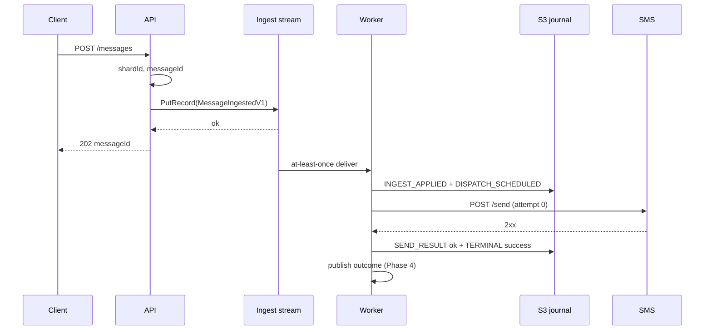
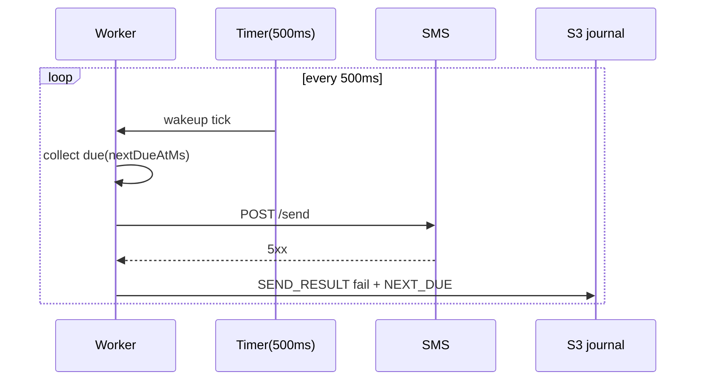

# NEW_SYSTEM_IMPLEMENTATION_BLUEPRINT.md

**Autonomous agents:** implement **§29** as the locked baseline (layout, **SQS FIFO** durable ingest, env, internal HTTP, journal sequences). **§29** overrides ambiguous text elsewhere. **Do not** implement by importing or copying **`v1_obsolete`** / **`inspectio_exercise`** Python code — see **§29.11**.

**Ingest transport:** this repository uses **Amazon SQS FIFO** (`INSPECTIO_INGEST_QUEUE_URL`) for durable admission. **§18.3** (journal flush before releasing the message — **DeleteMessage** for SQS).

**Implementation sequencing:** **`plans/IMPLEMENTATION_PHASES.md`** — phased PR plan (greenfield code is **not** required to live in the same change set as this blueprint).

## 1) Goal

Implement a throughput-oriented SMS retry system that preserves the assignment contract while removing known bottlenecks from synchronous request orchestration and per-message S3 hot-path writes.

Primary outcomes:

- sustain high ingest throughput (`POST /messages/repeat`) without 60s timeout failures;
- preserve retry correctness and crash resilience with S3-backed recovery;
- keep exact retry schedule semantics and 500ms scheduler cadence.

## 2) Constraints from assignment

Source text: **ASSIGNMENT.pdf** (“SMS Retry Scheduler - Consolidated Spec”). Clause-by-clause map: **§2.0**. Summary bullets:

- `newMessage(Message m)` immediate first attempt semantics (attempt #1 at 0s);
- `wakeup()` every 500ms exact scheduler heartbeat;
- retry schedule: attempt **#2–#6** at **0.5s, 2s, 4s, 8s, 16s** after **initial arrival** (with **#1** at 0s); see **§6.2**;
- durability across restart using S3 as source of truth for recovery;
- API/UI:
  - `POST /messages`
  - `POST /messages/repeat?count=N`
  - `GET /messages/success?limit=100`
  - `GET /messages/failed?limit=100`

### 2.0 ASSIGNMENT.pdf — line / clause sweep (*validation*)

Each row quotes the PDF intent (not necessarily verbatim). Status **Pass** = covered by cited sections; **Ext** = operational extra not stated in the PDF body.

| # | PDF clause | Requirement | This spec | Status |
|---|------------|-------------|-----------|--------|
| G1 | **Goal** | Performant SMS retry; **tens of thousands/sec**; clear separation of concerns; **minimal contention**; **AWS** runtime; **S3** survives restarts; **tiny API/UI** for ops + load test | **§1**, **§3**, **§7**, **§8**, **§15** | Pass |
| A1 | **Given API** | `boolean send(Message)` — true success, false failure | **§25**, **§19** | Pass |
| A2 | **Given API** | `void newMessage(Message)` — called on every arrival | **§25**, ingest → **`new_message`** **§20.2** | Pass |
| A3 | **Given API** | `void wakeup()` — every **500 ms (exact)** | **§20.1** | Pass |
| A4 | **Given API** | Signatures unchanged; may add helpers/types/threads/structures | **§13**, **§25** module boundary | Pass |
| A5 | **Concurrency** | **`newMessage` and `wakeup` may run concurrently** (multi-threaded) | **§20.3.1** per-`messageId` exclusion; parallel across ids | Pass |
| R1 | **Retry timeline** | Attempt **#1** deadline **0 s** (**inside `newMessage`**) | **§6.2** row 1; **§6.1** / **§20.2** | Pass |
| R2 | **Retry timeline** | Attempt **#2** **0.5 s** after **initial arrival** | **§6.2** | Pass |
| R3 | **Retry timeline** | Attempts **#3–#6** at **2 s, 4 s, 8 s, 16 s** after **initial arrival** | **§6.2** | Pass |
| R4 | **Failure rule** | If attempt **#6** fails, **discard** message and mark **failed** | **§6.2** terminal failed; **§4.2** `attemptCount == 6` | Pass |
| AWS1 | **AWS runtime** | EC2 / ECS / similar; **credentials** provided separately | **§7**, **§26** runbook | Pass |
| AWS2 | **AWS runtime** | **500 ms** `wakeup()` cadence **reliable** in chosen runtime | **§20.1**; **§8** metrics | Pass |
| P1 | **S3 — fields** | `messageId`, **`attemptCount` (0..6)**, **`nextDueAt`** (epoch ms), **`status`** (pending/success/failed) | **§4.2** (see **§6.2** for pending vs terminal counting) | Pass |
| P2 | **S3 — fields** | Optional: **`lastError`**, **history** | **§4.2**, journal payloads **§18.2** | Pass |
| P3 | **S3 — fields** | Original **payload** needed to call `send` | **§4.1**, **§4.2**, **§18.4** | Pass |
| P4 | **S3 — when** | **On initial enqueue** | **`INGEST_APPLIED`** / admission journal **§18.2**, **§18.3** | Pass |
| P5 | **S3 — when** | **After each attempt** (success or failure) with updated state | **`SEND_ATTEMPTED`**, **`SEND_RESULT`**, **`NEXT_DUE`** / **`TERMINAL`** **§18.2** | Pass |
| P6 | **S3 — when** | **On terminal** (success or failed) | **`TERMINAL`** **§18.2**; optional terminal objects **§5.1** | Pass |
| P7 | **S3 — layout** | Example keys under `state/pending|success|failed/...` — **suggestion, not mandated** | **§5.1** journal/snapshot layout; **§2.2** PDF example illustrative | Pass |
| P8 | **S3 — SoT** | In-memory indexes/caches allowed; **S3 source of truth for recovery** | **§2.2**, **§14**, **§18** | Pass |
| H1 | **POST /messages** | Send single message; **message body**; **returns assigned `messageId`** | **§15.1** (`body` required; `messageId` in response; **202** async admit) | Pass |
| H2 | **POST /messages/repeat** | `?count=N`; body reused **N** times; **list of messageIds or summary** | **§15.2** | Pass |
| H3 | **GET outcomes** | **`/messages/failed?limit=100`**, **`/messages/success?limit=100`** (examples) | **§15.3** default **100**; optional higher cap documented | Pass |
| H4 | **Outcomes — note** | “Last 100” ordered by **most recent attempt time** | **§15.3** — **`finalTimestamp`** = terminal instant (completion of last attempt); sort **most recent first** | Pass |
| H5 | **Outcomes — fields** | **`messageId`**, **`attemptCount`**, **`finalTimestamp`**, **brief `reason` if failed** | **§15.3** JSON | Pass |
| H6 | **UI** | Simple **HTML** hitting REST is a **plus**, not mandatory | *Informative*; optional frontend over **§15** JSON | Pass |
| N1 | **NFR — throughput** | Design for **tens of thousands/sec** | **§3**, **§16–§17**, **§20** | Pass |
| N2 | **NFR — contention** | **Minimize locks** and hot spots | **§16** sharding; **§20.3** bounded concurrency; **§20.3.1** fine-grained lock | Pass |
| N3 | **NFR — idempotency** | **Reasonable** handling if **`newMessage` called twice for the same payload** | **§17.4** dedupe (`idempotencyKey` / `messageId`); at-least-once ingest **§17.3**; *interpretation:* duplicate **delivery** of same logical message must not double-schedule (**§4.1**) | Pass |
| N4 | **NFR — crash** | After restart, retries proceed from **persisted S3** state | **§18** replay; **§14** phase table | Pass |
| N5 | **NFR — time** | **Not earlier than due**; **not significantly later** under load | **§6.2** “never before due”; **§8** `scheduler_lag_ms` SLO *informative* | Pass |
| D1 | **Deliverables** | **Java or Python** implementation | **§13** — **Python** for this repository | Pass |
| D2 | **README** | Data structures + **synchronization**; **time/space complexity**; **gaps**; **AWS** how to run; **S3 keys + schema** | **§26** | Pass |
| D3 | **Submission** | GitHub link; **commit history** matters | *Process*; not codified in spec—**§26** points to README | Pass |
| AC1 | **Acceptance** | `newMessage` does attempt **#1** immediately; schedules rest correctly | **§12**, **TC-SUR-001** / **§6** | Pass |
| AC2 | **Acceptance** | `wakeup` due retries on **0.5 s** cadence **without heavy contention** | **§20.1**, **§20.3** | Pass |
| AC3 | **Acceptance** | After **6 failed** attempts: discarded / **failed** | **§6.2**, **TC-DOM-004**, **TC-SUR-003** | Pass |
| AC4 | **Acceptance** | Successes + failures **queryable** (**last 100** each) | **§15.3**, **TC-API-006/007** | Pass |
| AC5 | **Acceptance** | Restart **does not lose** pending work; **respects** next scheduled times | **§18**, **TC-REC-001** | Pass |
| AC6 | **Acceptance** | Runs on **AWS** with provided credentials | **§7**, **§26** | Pass |
| O1 | **Out of scope** | Delivery semantics **beyond** given `send` contract | *Informative* — do not over-spec SMS delivery | Pass |
| O2 | **Out of scope** | Multi-tenant **auth**, complex UI | *Informative* | Pass |
| X1 | *(not in PDF)* | **`GET /healthz`** for probes | **§15.4** | Ext |

### 2.1 Condensed traceability (*quick index*)

| Topic | Sections |
|-------|----------|
| Assignment surface (`send` / `new_message` / `wakeup`) | **§25**, **§13** |
| Retry table (absolute from arrival) | **§6.2**, **§21** |
| S3 durability + journal | **§2.2**, **§14**, **§18** |
| HTTP API | **§15** |
| Tests vs acceptance | **§28**, **§12** |
| Agent-locked implementation path | **§29** (**§29.13** + **`IMPLEMENTATION_PHASES.md`**) |
| Ops-only **healthz** | **§15.4** (**§2.0** X1) |

### 2.2 S3 vs ingest stream (*reconciles PDF with this design*)

The PDF requires **persisting retry state to S3** so the system survives restarts, and allows extra caches. This spec adds a **durable ingest boundary** (**Amazon SQS FIFO** in this repository — **§17**, **§29**) for admission throughput. If the assignment PDF names a different stream technology, treat it as the same intent: durable handoff before worker processing.

**Normative split:**

- **S3** (journal segments + snapshots; optional terminal objects) is the **source of truth for scheduler/retry recovery**.
- The **ingest stream** is the **durable admission boundary** for `POST /messages` acceptance, **not** a replacement for journaling retry transitions.

**Checkpoint rule:** The stream consumer **must not** commit a checkpoint past a record until the worker has **durably written** every `JournalRecordV1` needed to recreate in-flight state for that message after crash (**§18.3**). That preserves the assignment’s crash-recovery intent while allowing a high-throughput ingress path.

The PDF’s `state/pending/...` key layout is **illustrative**; the journal layout (**§5.1**, **§18**) is an allowed alternative as long as S3 remains recovery SoT.

### 2.3 Legacy `v1_obsolete` wording vs this spec (*trap*)

`v1_obsolete/plans/PLAN.md` §5 once described retry delays as **gaps after each failed attempt** (“relative to the previous attempt”). **This spec’s normative schedule is §6.2:** deadlines are **absolute from `arrivalMs`** (`receivedAtMs` on first ingest). Those two models are **not equivalent** (e.g. late attempt #1 shifts all subsequent absolute deadlines). Implement **§6.2** + **§21**; treat the obsolete PLAN sentence as **historically misleading**, not a second source of truth.

## 3) Architecture (target)

### 3.1 Planes

1. **Ingress plane** (API):
   - accepts request, validates payload, assigns `messageId`, emits ingest event;
   - returns quickly after durable ingest append (not after worker activation/send).

2. **Scheduler/execution plane** (workers):
   - partition ownership by shard;
   - immediate dispatch trigger for attempt #1;
   - 500ms tick drives due retries from in-memory timing wheel/min-heap.

3. **Durability plane** (S3 journal + snapshot):
   - append-only retry state journal in micro-batches;
   - periodic shard snapshots for bounded restart replay.

4. **Read plane** (outcomes service + Redis):
   - terminal outcomes indexed in Redis bounded lists;
   - optional durable **notification log** in S3 under a **`state/notifications/...`**-style prefix (**§5.1**, **§15.3**) plus **hydration** into Redis on cold start—**not** required on every `GET` (**§15.3**).

### 3.2 Why this fixes observed failures

- removes blocking API->worker synchronous orchestration from submit critical path;
- replaces per-transition S3 object chatter with batch append semantics;
- isolates scheduler timing correctness from persistence/list-prefix polling delays;
- decouples "ingest SLO" from "drain completion + integrity scanning."

## 4) Component contracts

### 4.1 Ingest event contract

Event type: `MessageIngestedV1`

Required fields:

- `messageId: string`
- `payload: { body: string, to?: string, ... }` — fields required to build **`Message`** for **§25** / **§19**
- `receivedAtMs: int`
- `shardId: int`
- `idempotencyKey: string` (or equal to `messageId`)

Rules:

- event append must be durable before API returns success;
- duplicate `idempotencyKey` must not create duplicate active state.

### 4.2 Retry state contract

Record type: `RetryStateV1`

Fields:

- `messageId: string`
- `attemptCount: int` (0..6) — **number of completed `send()` calls**; in **`status=pending`** this is **0..5** only (before the sixth `send` is attempted). Value **6** appears **only** on **terminal failed** after the sixth `send` completes unsuccessfully; terminal **success** carries **k ∈ 1..6** = number of sends that ran, including the successful one
- `nextDueAtMs: int`
- `status: pending|success|failed`
- `lastError: string|null`
- `payload: object` (data required to call `send`)
- `updatedAtMs: int`

Invariant:

- for `status=pending`, **`nextDueAtMs`** for the **next** scheduled `send` is **`arrivalMs + OFFSET[attemptCount]`** where `OFFSET = [0, 500, 2_000, 4_000, 8_000, 16_000]` milliseconds and **`attemptCount`** is the **number of sends already completed** (0 before the first `send`, 1 after the first `send` completes, …, 5 after the fifth completes and before the sixth—see **§6.2**);
- terminal states (`success|failed`) are immutable except metadata enrichment.

**HTTP outcomes (**§15.3**):** `attemptCount` in JSON is the **same counter** at terminal time (e.g. **1** after first-try success, **6** after six failed `send()` calls), so it matches the PDF’s “last 100” fields.

### 4.3 Outcome contract

Event type: `MessageTerminalV1`

Fields:

- `messageId`
- `terminalStatus: success|failed`
- `attemptCount`
- `finalTimestampMs`
- `reason` (required for failed)

Read API derives `last 100` from this stream/index, not from full S3 scans.

## 5) Data layout

### 5.1 S3 keys

Bucket: `<configured-bucket>`

- Journal segments:
  - `state/journal/<shardId>/<yyyy>/<MM>/<dd>/<hh>/<segmentStartMs>-<seq>.ndjson.gz`
- Snapshots:
  - `state/snapshot/<shardId>/latest.json`
  - `state/snapshot/<shardId>/<epochMs>.json`
- Optional terminals (audit):
  - `state/terminal/<yyyy>/<MM>/<dd>/<hh>/<messageId>.json`

### 5.2 Redis keys (read plane + transient indexes)

- `inspectio:outcomes:success` (bounded list)
- `inspectio:outcomes:failed` (bounded list)
- `inspectio:idempotency:<idempotencyKey>` (TTL map to `messageId`)

## 6) Scheduling model

### 6.1 Immediate attempt

- on ingest append success, enqueue item to shard-local immediate queue;
- worker processes immediate queue without waiting for next tick;
- if queue handoff fails, tick-based due scan picks it up within 500ms.

### 6.2 Retry schedule (normative — assignment semantics)

Deadlines are **absolute from the message’s original arrival time** `arrivalMs` (use `receivedAtMs` from the first `MessageIngestedV1` for that `messageId`; must not drift per attempt).

| Attempt # (1-based) | `attemptCount` **before** this `send` | `nextDueAtMs` |
|---------------------|---------------------------------------|---------------|
| 1 | 0 | `arrivalMs` |
| 2 | 1 | `arrivalMs + 500` |
| 3 | 2 | `arrivalMs + 2_000` |
| 4 | 3 | `arrivalMs + 4_000` |
| 5 | 4 | `arrivalMs + 8_000` |
| 6 | 5 | `arrivalMs + 16_000` |

After **six** `send` attempts, if the last outcome is failure, transition to **terminal failed** (no seventh `send`). On any success, **terminal success** immediately. At terminal failure after the sixth `send`, **`attemptCount` is 6**; at terminal success after the *k*-th `send`, **`attemptCount` is *k***.

Rules:

- never invoke `send` before `nowMs >= nextDueAtMs` for that attempt;
- track and export scheduler lag: `nowMs - nextDueAtMs` when dispatch runs.

## 7) AWS runtime blueprint

### 7.1 Recommended stack

- **EKS**: API, worker, notification; **health-monitor** *optional* (on-demand integrity vs mock audit). Implement against **§7** / this spec only — **do not** embed **`v1_obsolete`** code paths.
- **S3**: durability (journal + snapshot + optional terminal logs);
- **ElastiCache Redis**: outcomes hot index and idempotency cache;
- **Amazon SQS FIFO**: durable ingest (**§17**, **§29**);
- **ALB/Ingress**: API/UI endpoints.

### 7.2 IAM

- IRSA role for writer components with scoped S3 prefix access;
- separate read-only role for health/analysis if needed;
- no static AWS secrets in ConfigMaps.

## 8) Observability blueprint

### 8.1 Required metrics

- ingest:
  - `api_submit_latency_ms` (p50/p95/p99)
  - `ingest_events_appended_total`
  - `ingest_rejected_total`
- scheduler:
  - `scheduler_tick_duration_ms`
  - `scheduler_lag_ms`
  - `attempts_total{attempt,status}`
- persistence:
  - `journal_flush_batch_size`
  - `journal_flush_latency_ms`
  - `snapshot_latency_ms`
  - `s3_errors_total`
- outcomes:
  - `outcome_publish_latency_ms`
  - `outcome_index_write_errors_total`

### 8.2 Required logs

Structured logs with `messageId`, `shardId`, `attemptCount`, `phase`, `traceId`.

## 9) Rollout plan (phased)

**Normative persistence and source-of-truth progression** (how Phase 1 relates to journal/snapshots) is defined in **§14**. Use that table when planning tickets so agents do not ship an “API-only” Phase 1 that lacks crash-safe retry state.

### Phase 1 — API critical path decoupling

Deliverables:

- submit returns after durable ingest append only;
- **HTTP / FastAPI** does not `await` worker remote activation or in-process **`send()`** on the request stack (**§15**);
- add ingest / stream metrics (**§8**).

**Clarification (avoids contradiction with §25):** “Backgrounded” means the **public REST handler** returns without blocking on SMS or cross-service worker orchestration. The **`new_message` / stream-consumer path** still runs **attempt #1** inside the worker runtime per **§6.1** / **§20.2**—that work is **off the client HTTP critical path**, not “removed from the system.”

Acceptance:

- no 60s submit timeout at 10k batch profile;
- p95 submit latency materially reduced vs baseline.

### Phase 2 — Scheduler hardening

Deliverables:

- shard-local immediate queue + 500ms tick coexistence;
- deterministic retry timing checks;
- idempotency handling at ingest.

Acceptance:

- deadline compliance under stress (no early retries, bounded lag);
- duplicate ingest calls do not duplicate active work.

### Phase 3 — S3 journal + snapshot durability

Deliverables:

- micro-batched journal writer;
- periodic snapshots;
- restart replay logic (snapshot + journal tail).

Acceptance:

- crash/restart recovers pending retry workload correctly;
- S3 operation rate per message significantly reduced.

### Phase 4 — Read plane stabilization

Deliverables:

- Redis outcomes as source for `last 100` APIs;
- bounded hydration strategy with leader lock;
- optional terminal audit sink to S3.

Acceptance:

- `GET /messages/success|failed?limit=100` stays low-latency at load;
- no destructive hydration races in multi-replica notification service.

## 10) Test blueprint

**Normative Python detail:** **§28** (tooling, markers, required unit/integration cases, load-test rules).

### 10.1 Functional

- first attempt runs immediately after ingest;
- retry deadlines exactly follow assignment schedule;
- fail after 6th failed attempt;
- success/failed APIs return recent terminal records.

### 10.2 Reliability

- kill worker mid-flight -> restart -> recover from S3 journal/snapshot;
- Redis unavailable transiently -> outcomes eventual catch-up path;
- ingest stream backpressure -> explicit rejection policy and no silent drop.

### 10.3 Performance

- in-cluster AWS load jobs only;
- measure separately:
  - submit throughput,
  - scheduler throughput,
  - terminalization throughput,
  - durability write throughput.

## 11) Risks and mitigations

- **Risk:** eventual consistency between terminal event and read API.
  - **Mitigation:** durable terminal event log + retryable index update.
- **Risk:** shard imbalance.
  - **Mitigation:** shard cardinality > worker count and rebalance tooling.
- **Risk:** replay lag after large outage.
  - **Mitigation:** frequent snapshots + bounded journal segment size.

## 12) Definition of done

- submit path reliably handles large repeat batches without request-time disconnect pattern;
- retry timing and max-attempt semantics pass deterministic tests (**§28**, all **TC-** ids applicable to current phase);
- restart recovery validated from S3 durability artifacts;
- last-100 APIs remain stable and fast under load;
- documented runbook for AWS deployment, scaling, and recovery (**§26**);
- **`send` / `new_message` / `wakeup`** covered per **§25** and **TC-SUR-*** ;
- no contradiction between **HTTP** fast-return (**§15**) and **§25** first-attempt semantics (**§9 Phase 1** clarification).

---

# Tier-3 implementable specification (normative)

The following sections are **normative** for implementers unless explicitly marked *informative*. If a prior section conflicts with this tier-3 text, **this tier-3 text wins**.

**Autonomous agents:** **§29** is a **single locked implementation path** (repository layout, **SQS FIFO** ingest, env vars, internal HTTP, journal templates, forbidden shortcuts). Where **§29** is stricter or more specific than earlier sections, **§29 wins**. Humans may waive **§29** subsections in writing; agents **must not** silently substitute alternatives (e.g. Kafka, different URLs, or “simplified” persistence).

## 13) Implementation baseline

| Item | Normative choice |
|------|------------------|
| Language | **Python 3.11+** only (this repository implementation) |
| Public API framework | **FastAPI** served by **uvicorn** |
| Async HTTP client | **httpx** (async) for `send` and internal calls |
| AWS SDK | **aioboto3** / aiobotocore for S3; **SQS** client for **`send_message`**, **`send_message_batch`**, **`receive_message`**, **`delete_message`**, **`change_message_visibility`** — **§29** |
| Assignment hooks | The three functions **must exist as callable entrypoints** per **§25** (Python idiomatic names + README mapping). The **HTTP API** (§15) is separate operational surface; it **feeds** the same scheduler via the ingest stream. |
| Configuration | All limits, shard counts, URLs, and timeouts are **environment variables** or a single `Settings` object with **named constants** (no magic numbers in logic). |

## 14) Phased persistence and source of truth (clarified)

This resolves the Phase 1 vs Phase 3 ambiguity.

| Rollout phase | Admission (API) | Authoritative for “message accepted” | Authoritative for retry state / recovery |
|---------------|-------------------|----------------------------------------|------------------------------------------|
| **Phase 1** | After **successful durable write** to **ingest stream** (§17) | **Ingest stream** record with type `MessageIngestedV1` | **S3 journal** (§18): every transition that must survive crash **appends** a `JournalRecordV1` line. **Snapshots (§18.4)** are optional in Phase 1; if absent, recovery **replay scans journal** from T0 for that shard (acceptable for exercise-scale buckets; not for infinite history—see §18.4). |
| **Phase 2** | Same | Same | Same + stricter scheduler invariants (§6, §20). |
| **Phase 3** | Same | Same | **Snapshots required** for production SLO: bounded replay window; journal truncation policy *informative* per ops policy. |
| **Phase 4** | Same | Same | Same + Redis outcomes (§5.2) as **read-optimized projection** only. |

**Rule:** The API **never** blocks on worker `send`, worker HTTP activation, or journal compaction. It blocks only on **ingest stream write** (and minimal validation/idempotency cache round-trips as configured).

## 15) Public HTTP API (normative)

Base path: `/` on the **API gateway** service (behind ALB/Ingress). All JSON uses `UTF-8` and `Content-Type: application/json`.

### 15.1 `POST /messages`

**Purpose:** Admits a single message.

**Request body:**

```json
{
  "body": "string (required, non-empty after trim)",
  "to": "string (optional; if omitted, mock SMS adapter uses a default constant)"
}
```

*Informative (historical only):* an archived stack exposed **`shouldFail`** on `POST /messages` for tests. **Not normative here**—deterministic failures use **injected SMS fakes**, mock **`FAILURE_RATE`**, or **§25** / **§28.3** harnesses. **Do not** add `shouldFail` (or similar) to match archived APIs.

**Success `202 Accepted`:**

```json
{
  "messageId": "uuid4 lowercase string",
  "shardId": 0,
  "ingestSequence": "string | null (opaque; stream sequence id if available)"
}
```

- `shardId` is the **computed** shard (§16), not the worker pod id.

**Errors:**

| Status | When |
|--------|------|
| `400` | Missing/empty `body`, malformed JSON |
| `409` | *Not used in Phase 1* (**§29.10**); no **`Idempotency-Key`** on public API |
| `429` | Admission control / stream throttle (§20); include `Retry-After` when possible |
| `503` | Ingest stream unavailable; body `{"error":"ingest_unavailable","detail":"..."}` |

**Normative timing:** Handler **must not** `await` worker dispatch or `send()`. **§29 (agents):** the API **does not** `await` Redis on `POST /messages` in Phase 1; duplicate protection is **§17.4** on the worker after **SQS** delivery.

### 15.2 `POST /messages/repeat?count=N`

**Purpose:** Load test admission for **N** independent messages with the **same** JSON body.

**Query:** `count` integer, **required**, `1 <= count <= INSPECTIO_REPEAT_MAX_COUNT` (default **100_000**, configurable).

**Request body:** Same object as §15.1.

**Success `202 Accepted`:**

```json
{
  "accepted": 1000,
  "messageIds": ["uuid", "..."],
  "shardIds": [0, 1, "..."]
}
```

- `messageIds.length` **must** equal `accepted` **and** equal `count`.
- `shardIds[i]` is the shard for `messageIds[i]`.

**Assignment alignment:** the PDF allows returning **either** a list of ids **or** a **summary**. **§29 (agents):** implement **only** the **full list** schema above—**no** summary-only response in this repository.

*Informative for humans:* a summary-style body can still satisfy the PDF if you fork the spec; agents following this blueprint **must not**.

**Implementation note (*informative*):** Use **batched** `send_message_batch` (SQS FIFO, max **10** entries per call); the route may still accept large **`repeat`** counts and loop; return **one** HTTP response.

**Errors:** Same family as §15.1; `400` if `count` out of range.

### 15.3 `GET /messages/success` and `GET /messages/failed`

**Query:** `limit` optional integer, default **100**. **Normative minimum:** cap at least **100** to satisfy the assignment’s “last 100” examples. Implementations **may** allow a higher configured maximum (e.g. **1000**) for debugging if documented in **§26** env table—tighter caps are product choice, not a PDF contradiction.

**Success `200 OK`:**

```json
{
  "items": [
    {
      "messageId": "uuid",
      "attemptCount": 3,
      "finalTimestamp": 1700000000000,
      "reason": null
    }
  ]
}
```

- For **`failed`** items, `reason` is a **non-empty** string (short machine-readable code + optional message, implementation-defined but stable).
- Ordering: PDF asks for “most recent **attempt time**”; for **terminal** rows, define **`finalTimestamp`** as the **UTC epoch ms** when the message became terminal (i.e. when the **last** `send` attempt **completed**). Sort **descending** by `finalTimestamp` so “last 100” matches the PDF note.

**Implementation:** Served from **notification/read plane** Redis lists (Phase 4); API **proxies** or is **bff-only**—either is valid if the external contract above holds.

### 15.4 `GET /healthz`

**200 OK:** `{"status":"ok","service":"api"}` (or include build sha *informative*).

## 16) Sharding and worker ownership (normative)

### 16.1 Constants

- `TOTAL_SHARDS`: integer **>=** number of worker pods; default **1024**.
- `WORKER_REPLICAS` (Kubernetes): **W**.
- `SHARDS_PER_POD`: `ceil(TOTAL_SHARDS / W)`.

### 16.2 `messageId` → `shardId`

```text
h = SHA256(messageId) interpreted as unsigned 32-bit big-endian of first 4 bytes of digest
shardId = h % TOTAL_SHARDS
```

- `messageId` is **UTF-8** bytes into SHA256.

### 16.3 Pod → owned shard range

- `pod_index`: integer in `[0, W)` from **StatefulSet ordinal** (e.g. `worker-3` → `3`).
- Owns inclusive range:

```text
start = pod_index * SHARDS_PER_POD
end_excl = min((pod_index + 1) * SHARDS_PER_POD, TOTAL_SHARDS)
```

- Pod processes **only** messages whose `shardId` ∈ `[start, end_excl)`.

### 16.4 Stream partition key

- **SQS FIFO `MessageGroupId`:** string `f"{shardId:05d}"` (fixed-width decimal; same as legacy “partition key”).

## 17) Ingest stream (normative)

### 17.1 Technology

**This repository (agents):** **Amazon SQS FIFO** — queue URL **`INSPECTIO_INGEST_QUEUE_URL`** (**§29.4**). Implement **`send_message_batch`** from API and **`receive_message`** + **`delete_message`** after **§18.3** in worker.

*Informative:* MSK/Kafka is an architecturally valid alternative for other teams; **do not implement it here** unless **§29** is explicitly revised.

### 17.2 Record value

**Payload:** UTF-8 JSON of `MessageIngestedV1` (§4.1), with enforced fields:

```json
{
  "schema": "MessageIngestedV1",
  "messageId": "...",
  "payload": { "body": "...", "to": "..." },
  "receivedAtMs": 1700000000000,
  "shardId": 42,
  "idempotencyKey": "same as messageId unless client key used"
}
```

### 17.3 Delivery semantics

- **At-least-once** from stream to consumer.
- Consumer **must** tolerate duplicate records.

### 17.4 Dedupe (normative minimum)

Before creating **new** in-memory work for `(idempotencyKey)`:

1. `SET inspectio:idempotency:<idempotencyKey> -> messageId` with **`NX`** and TTL **86400** seconds (configurable).
2. If `SET` fails (key exists): **ack offset** and **do not** enqueue duplicate dispatch.

*(Alternative enterprise pattern: conditional write in DynamoDB; Redis is sufficient for exercise scope.)*

### 17.5 Consumer topology

- **One SQS FIFO queue** per deployment (optional **FIFO DLQ** + redrive policy in AWS).
- **Commit:** consumer **must not** **`DeleteMessage`** until **§18.3** is satisfied for that ingest (durably journaled state). “Enqueue to worker memory” **alone** is insufficient if a crash could lose work before journal lines exist.
- **Multi-replica workers:** use **logical shard ownership** + **`ChangeMessageVisibility(0)`** for foreign messages; **§29.6** locks **default single-worker** until validated — see **`deploy/kubernetes/README.md`**.

## 18) S3 journal and snapshots (normative)

### 18.1 Journal segment files

- Path per §5.1.
- **Format:** `gzip` compressed **NDJSON** (one `JournalRecordV1` per line, UTF-8 JSON).
- **Ordering inside a segment:** append-only; **monotonic** `recordIndex` per shard (see below).

### 18.2 `JournalRecordV1` (line schema)

Every line **must** include:

```json
{
  "v": 1,
  "type": "INGEST_APPLIED | DISPATCH_SCHEDULED | SEND_ATTEMPTED | SEND_RESULT | NEXT_DUE | TERMINAL",
  "shardId": 0,
  "messageId": "uuid",
  "tsMs": 1700000000000,
  "recordIndex": 123456789,
  "payload": {}
}
```

**`payload` by `type` (normative fields):**

| `type` | `payload` fields |
|--------|------------------|
| `INGEST_APPLIED` | `receivedAtMs`, `idempotencyKey`, **`bodyHash`** — **§29.5:** lowercase **hex SHA-256** of UTF-8 **`payload.body`** (required for agent implementations) |
| `DISPATCH_SCHEDULED` | `reason`: `"immediate" \| "tick" \| "replay"` |
| `SEND_ATTEMPTED` | `attemptIndex`: **integer in 0..5**, equal to **completed** `send` count **before** this attempt starts (same as **§6.2** “`attemptCount` before this `send`” column; first `send` → `0`, sixth `send` → `5`) |
| `SEND_RESULT` | `attemptIndex` (same meaning as **SEND_ATTEMPTED**), `ok` boolean, `httpStatus` int \| null, `errorClass` string \| null |
| `NEXT_DUE` | `attemptCount`: **completed** `send` count **after** the failure that triggered this schedule (1..5); `nextDueAtMs`: next deadline per **§6.2** |
| `TERMINAL` | `status`: `"success" \| "failed"`; `attemptCount`: **1..6** per **§4.2** (**6** only for terminal **failed** after sixth failed `send`; **1..6** for **success** = number of sends completed); `reason` required if **failed** |

**Ordering:** `recordIndex` is **per-shard** strictly increasing; writer **must** use a single-writer-per-shard rule or external fencing (single consumer group instance per shard simplifies).

### 18.3 Durability rule

Any transition that changes **whether a send will occur again** or **when** must have a **`JournalRecordV1`** persisted **before** acknowledging the **ingest stream** checkpoint for that record.

**First ingest for a `messageId`:** checkpoint **must not** advance past the `MessageIngestedV1` record until at least **`INGEST_APPLIED`** (and any **`DISPATCH_SCHEDULED`** / initial **`nextDueAtMs`** state you rely on for replay) is **durable** in the journal for that ingest—otherwise a crash after ack loses the message entirely.

**After each `send` outcome:** worker implementation typically journals **`SEND_RESULT`** and **`NEXT_DUE`** / **`TERMINAL`** in **the same flush** as the checkpoint commit for the cursor position that unlocked that work (when coupled to stream offsets).

**Ordering:** for a single `messageId`, journal writes for that message **should be ordered** so replay can reconstruct state; cross-message ordering may interleave.

*Informative:* micro-batch 10–100 ms or N=64 lines, whichever first.

### 18.4 Snapshot `latest.json`

```json
{
  "v": 1,
  "shardId": 7,
  "capturedAtMs": 1700000000000,
  "lastRecordIndex": 999,
  "active": {
    "message-id-uuid": {
      "messageId": "message-id-uuid",
      "attemptCount": 2,
      "nextDueAtMs": 1700000001500,
      "status": "pending",
      "lastError": null,
      "payload": { "body": "x", "to": "y" }
    }
  },
  "terminalsIncluded": false
}
```

- **`active`:** only `status=pending` messages **owned** by shard at snapshot time.
- **Recovery:** load snapshot, then **replay journal** lines with `recordIndex > lastRecordIndex` for that shard.
- **Phase 3 completion:** snapshots **required**; snapshot interval configurable (e.g. 60s).

## 19) SMS `send` adapter (normative)

### 19.1 Wire contract (mock / provider)

`POST {INSPECTIO_SMS_URL}/send` — **`INSPECTIO_SMS_URL`** is a **base** URL **without** `/send` (**§29.4**).

```json
{
  "to": "+15550001",
  "body": "text",
  "messageId": "uuid",
  "attemptIndex": 0
}
```

**Normative:** `attemptIndex` **must** match the **§6.2** “before this `send`” `attemptCount` for that dispatch (`0` for the first `send`, `5` for the sixth).

### 19.2 Outcome mapping

| HTTP | Maps to `send() -> bool` |
|------|----------------------------|
| `2xx` | `true` |
| `5xx` or network error | `false` |
| `4xx` | `false` (treat as failure; log distinct tag) |

### 19.3 Timeouts

`INSPECTIO_SMS_HTTP_TIMEOUT_SEC` default **5**; **named constant**.

## 20) Scheduler, concurrency, and backpressure (normative)

### 20.1 `wakeup` cadence

- Each worker runs a loop: wake every **500 ms wall-clock target** (`INSPECTIO_WAKEUP_INTERVAL_MS=500`).
- *Informative:* correct for drift by sleeping `max(0, next_tick - now)` based on monotonic clock anchor.

### 20.2 Immediate attempt #1

- On consuming `MessageIngestedV1`, enqueue to **shard immediate queue**; worker **may** process before next tick.
- If immediate queue overflows: **drop to tick path** only if still durable via `nextDueAtMs <= now` check—**must not** lose durability: journal must reflect admitted message.

### 20.3 Per-tick concurrency

- `INSPECTIO_MAX_PARALLEL_SENDS_PER_SHARD` default **64**; bounded semaphore per shard.

### 20.3.1 Concurrency vs assignment (*`newMessage` ∥ `wakeup`*)

The assignment allows **`newMessage` and `wakeup` concurrently** (multi-threaded). **Normative:** the runtime **must** use per-`messageId` exclusion (e.g. `asyncio.Lock`, `threading.Lock`, or actor mailbox) so **at most one** of {first `send` from `newMessage` path, retry `send` from `wakeup`} mutates `RetryStateV1` / journal lines for that id at a time. Parallel `send` **across different** `messageId`s remains required for throughput.

### 20.4 API backpressure

- If ingest batching exceeds **in-memory bound** `INSPECTIO_INGEST_BUFFER_MAX_MESSAGES` or stream throttles: respond **`429`** or **`503`** per §15—**never** block unbounded.

## 21) Time and timestamps (normative)

- All `*Ms` fields: **UTC epoch milliseconds** from **`time.time()`**-style wall clock on the writing process unless noted.
- `nextDueAtMs` computed from **`arrivalMs` + offset** per §6.2 (not from “previous attempt time”).
- **Clock skew:** assume **NTP** on nodes; no special leap-second handling required; tests use fake clock.

## 22) Internal APIs

**Agents:** internal routes are **fixed** in **§29.6** (paths, methods, JSON). The table below is a summary; **§29.6 wins** on any mismatch.

| Producer | Consumer | Purpose |
|----------|----------|---------|
| API | SQS FIFO | ingest **`send_message_batch`** |
| Worker | SQS FIFO | **long-poll** + **delete** after journal (**§29.6**) |
| Worker | S3 | journal + checkpoints (**§29.4**) |
| Worker | Notification HTTP | terminal publish **§29.6** |
| Notification | Redis | last-100 lists (**§5.2**) |
| API | Notification HTTP | proxy **GET** outcomes **§29.6** |

## 23) Sequence diagrams (*informative*)

### 23.1 Happy path admission → first send



### 23.2 Retry tick



## 24) Agent implementation checklist

**Primary order:** **`plans/IMPLEMENTATION_PHASES.md`** (**P0–P10**). The list below is a **compressed** mirror of **§29** acceptance.

1. [ ] **P0–P2** — Package skeleton, pure domain, ingest + journal codecs (**§29.2**, **§6**, **§16–18**).
2. [ ] **P3–P5** — API **SQS FIFO** admission, S3 journal flush, consumer + **§18.3** commit (**§15**, **§17**).
3. [ ] **P6** — Scheduler + **`scheduler_surface`** + SMS client (**§19–20**, **§25**, **§29.7–29.9**).
4. [ ] **P7** — Notification + Redis + GET proxy (**§29.6**, **§5.2**).
5. [ ] **P8–P10** — Snapshots/replay, full **docker compose**, AWS + in-cluster load (**§14**, **§26**, **§28.6**).
6. [ ] **OpenAPI** + **§28** **TC-** coverage for every shipped phase (**§29.13** drift rule).

## 25) Assignment-mandated scheduler surface (normative)

The PDF requires a **non-changing trio** of call sites on `Message` (plus helpers). **Normative mapping:**

| PDF (Java-style) | Python (required) | Responsibility |
|------------------|-------------------|----------------|
| `boolean send(Message m)` | `send(message: Message) -> bool` | Calls **§19** adapter; returns **true** iff simulated/provider SMS succeeds |
| `void newMessage(Message m)` | `new_message(message: Message) -> None` | **Assignment attempt #1 at 0s:** enqueue + run first `send` as soon as scheduler allows; must match **§6.1** / **§20.2** semantics when driven from stream ingest |
| `void wakeup()` | `wakeup() -> None` | **500ms** heartbeat (**§20.1**); dispatches all due retries per **§6.2** |

**Module rule (agents — locked):** expose **`send`**, **`new_message`**, **`wakeup`** from exactly:

`inspectio.scheduler_surface`

i.e. `from inspectio.scheduler_surface import send, new_message, wakeup`. The **README MUST** map Python names to the PDF’s `newMessage` / `send` / `wakeup` spellings in a short table.

**vs HTTP:** FastAPI routes (**§15**) are **not** substitutes for these functions; they are the ops/load surface that **feeds** ingest, which ultimately drives the same scheduler.

## 26) README submission checklist (*assignment “brief README”*)

The submitted **README** must answer:

1. **Data structures & synchronization** — shard map (**§16**), ingest path, journal batching, per-`messageId` lock (**§20.3.1**), stream consumer groups (**§17**).
2. **Complexity** — big-O *informative* for batch ingest, per-tick dispatch, journal replay recovery.
3. **Gaps / next steps** — e.g. snapshot truncation, multi-region, Exactly-once provider semantics.
4. **AWS runbook** — how to provision stream, S3 bucket, Redis, EKS manifests; env var table.
5. **S3 layout & schema** — **§5.1**, **§18** record `v` field, snapshot `lastRecordIndex` replay rule.

## 27) Document control

| Version | Change |
|---------|--------|
| 1.18 | **§3.1** / **§15.1** / **§28.5** / **§29.3** / **§28.11**: spec-only notification prefix; explicit **no** `shouldFail`; E2E **not** sourced from **`v1_obsolete/**`**; **`mock-sms`** = **`deploy/mock-sms/Dockerfile`**; **§7** audit row without v1 wording |
| 1.17 | **§29.11** / **`IMPLEMENTATION_PHASES.md`**: **`mock-sms`** image **must** be **`deploy/mock-sms/Dockerfile`** — **not** **`v1_obsolete/`** build context |
| 1.16 | **§29.11** + **`IMPLEMENTATION_PHASES.md`**: forbid using **`v1_obsolete` / `inspectio_exercise`** as implementation source; **§28.11** cross-check no longer treats v1 proxy docs as normative |
| 1.15 | **`IMPLEMENTATION_PHASES.md`**: verbatim **§29.2** + **§29.3** tables; each phase **§29.2 touch rows** subset copied from blueprint |
| 1.14 | **`IMPLEMENTATION_PHASES.md`**: agent-readiness table, per-phase template (Prerequisites / Read first / Touch list / Implement / Do not / Verify), fixed **§9** crosswalk, dependency graph |
| 1.13 | **`plans/IMPLEMENTATION_PHASES.md`**; remove in-repo Python scaffold; **§29.13–29.14** compose = infra-only until implementation PR; blueprint pointer |
| 1.12 | **§29.13–29.14** `docker-compose.yml`, **`deploy/docker/Dockerfile`**, LocalStack init, **`plans/openapi.yaml`**; root **`pyproject.toml`**, **`src/inspectio`** scaffold, **`.dockerignore`** |
| 1.11 | **§29** agent execution contract (locked **SQS FIFO** ingest, **src/inspectio** tree, full env table, internal HTTP, journal templates, forbidden list); **§17.1/17.5**, **§22**, **§24**, **§25** import path, **§15.2** repeat response; tier-3 **§29** precedence |
| 1.10 | **ASSIGNMENT.pdf** clause-by-clause **§2.0** sweep (G1–AC6, P1–P8, N1–N5, D1–D3, O1–O2, X1); **§2.1** condensed index; **`GET /healthz`** marked **Ext**; **§15.3** `finalTimestamp` ↔ PDF “attempt time”; **§28.11** |
| 1.9 | Drop normative **`shouldFail`** from public/ingest contract (**§15.1**, **§4.1**, **§2.1**, **TC-API-009**, **§28.11**); tests via fakes / **§25** only; *informative* note under **§15.1** |
| 1.8 | Deep audit: **§2.3** vs `v1_obsolete` PLAN retry wording; **`shouldFail`** **§2.1/§4.1/§15.1**; **§18.3** ingest-first journal before checkpoint; **§15.3** `limit` cap note; read-plane S3 notifications **§3.1**; **TC-API-009**; **§28.11** rows |
| 1.7 | Full pass: **§9** Phase structure + Phase1/§25 clarification; **§17.5**↔**§18.3**; **§18.2** NEXT_DUE/TERMINAL; **§2.1** storage+healthz; **§7** health-monitor optional; **§12** DoD; **§28.3** schedule wording; **§28.11** expanded |
| 1.6 | **§28.11** validation audit; **§4.2** / **§18.2** / **§19** attemptIndex/attemptCount alignment; TC/SUR/REC/Hypothesis fixes |
| 1.5 | **§28.8–28.10** detailed test catalog (TC-* ids), fixtures, fault injection |
| 1.4 | **§28** Python/pytest test specification; **§13** Python-only |
| 1.3 | Assignment validation pass: **§2.1–2.2**, **§4.2/§6.2** counter alignment, **§18.3** checkpoint, **§20.3.1** concurrency, **§25–26**, `/repeat` summary note |
| 1.2 | §6.2 corrected to **assignment absolute-from-arrival** deadlines (was wrongly stated as per-step deltas) |
| 1.1 | Added tier-3 normative sections after §12 |
| 1.0 | Original blueprint §§1–12 |

## 28) Python test specification (normative)

### 28.1 Tooling

| Tool | Use |
|------|-----|
| **pytest** | Primary runner; `pyproject.toml` or `pytest.ini` defines markers |
| **pytest-asyncio** | Async unit/integration tests (`async def` tests, scoped event loop) |
| **httpx** | `ASGITransport` against FastAPI app for §15 contract tests **without** TCP |
| **hypothesis** | *Recommended* for `nextDueAtMs`, shard id, and journal replay invariants |
| **fakeredis** / **redis** in Docker | Idempotency + outcomes lists (**§17.4**, **§5.2**) |
| **moto** / **LocalStack** / **in-memory fakes** | S3 journal read/write; **SQS FIFO** where CI budget allows (**§29**) |

Fakes **must** enforce the same JSON shapes as **§17.2** and **§18.2** so tests are contract-valid.

### 28.2 Markers (recommended)

| Marker | Scope |
|--------|--------|
| `unit` | No I/O; pure domain, clocks, hashing, journal line parse/build |
| `integration` | I/O to docker services, moto, or LocalStack |
| `e2e` | Multi-container stack (optional CI tier) |
| `performance` | Load scripts / large N; **AWS performance claims** only when run **in-cluster** per workspace rules |

**PR gate (*informative*):** `pytest -m "unit or integration"` green; `e2e` nightly or manual.

### 28.3 Required unit tests (no HTTP to real dependencies)

1. **§6.2 schedule** — For each **completed-send count** `c` in **`0..5`** (matches §6.2 “before this `send`” column), assert `next_due_ms(arrival_ms, c) == arrival_ms + OFFSET[c]` with `OFFSET = [0, 500, 2000, 4000, 8000, 16000]`.
2. **Terminal counts** — After sixth failed `send`, terminal state has **`attemptCount == 6`**; first-try success has **`attemptCount == 1`**.
3. **§16.2 sharding** — Golden tests: known `messageId` → expected `shard_id` for a fixed `TOTAL_SHARDS`.
4. **§18.2 journal lines** — Serialize/deserialize each `JournalRecordV1.type`; reject unknown `v` or missing required payload keys.
5. **§25 surface** — With **injected** fake clock + fake SMS + in-memory journal: call `new_message` then advance clock / call `wakeup` in a deterministic script; assert `send` call counts and outcomes match §6.2 (use `Message` model from code).
6. **§20.3.1 concurrency** — Two coroutines: one repeatedly calls `new_message`, one calls `wakeup`; `send` must never run **two overlapping attempts** for the same `messageId` (assert serialized per-id).

### 28.4 Required integration tests

1. **§15 ingest decoupling** — FastAPI `POST /messages` with **stub ingest** (no real worker): response is **202** in under a tight deadline **without** awaiting any `send` coroutine in the route stack (assert via spy/mocks on scheduler).
2. **§18.3 checkpoint vs journal** — Fake stream: deliver one record; **assert** `JournalRecordV1` lines for that id are visible in S3 (or moto bucket) **before** consumer commits checkpoint (or assert ordering callback sequence).
3. **§17.4 dedupe** — Publish duplicate `MessageIngestedV1` (same `idempotencyKey`); assert exactly one durable work unit in journal / one send sequence.
4. **Recovery** — Write journal lines + optional snapshot fixture; restart scheduler class in a **new process** or fresh instance; replay; pending work matches expected `nextDueAtMs`.
5. **§15.3 outcomes** — Terminal event → notification/Redis → `GET /messages/success` returns item with correct **`attemptCount`** and ordering by `finalTimestamp`.

### 28.5 E2E (*optional*)

- Docker Compose: API → stream adapter → worker → mock SMS → S3 → notification → GET outcomes.
- **Do not** copy **`v1_obsolete/**`** e2e tests or treat them as a contract; derive scenarios from **§28.4** and this spec. External multi-container **workflow** patterns are fine informally—**behaviour** is **this** document + **`plans/openapi.yaml`** only.

### 28.6 Performance / load tests

- **Local/smoke:** `pytest -m performance` may use small N (e.g. 100–1000) for regressions **only** on developer machines.
- **AWS throughput claims:** **must** use in-cluster driver (Kubernetes Job) hitting in-VPC URLs; document command and environment in README (**§26**).

### 28.7 Coverage and traceability (*informative*)

- Aim for **100% line coverage** on pure modules: retry schedule, shard hash, journal codec, idempotency helper.
- Map each **§2.0** PDF clause (or **§2.1** topic row) to at least one test module or test class name in **README** or `TESTING.md`.

### 28.8 Detailed test catalog (normative IDs)

Each case **must** exist as a `test_*` or `@pytest.mark.parametrize` expansion with the **TC id** in the docstring or test name suffix (e.g. `test_next_due_matches_offset_tc_dom_001`). **Suggested file layout** (*informative*): `tests/unit/domain/`, `tests/unit/journal/`, `tests/integration/api/`, `tests/integration/stream/`, `tests/integration/recovery/`.

---

#### Domain — schedule & attempts (`pytest.mark.unit`)

| ID | Given | When | Then |
|----|--------|------|------|
| **TC-DOM-001** | `arrival_ms = 1_700_000_000_000`, `attempt_count = 0` | Compute next due for **first** `send` | `next_due_ms == arrival_ms` |
| **TC-DOM-002** | Same arrival, `attempt_count = 1` (one failure done) | Compute next due before **2nd** `send` | `next_due_ms == arrival_ms + 500` |
| **TC-DOM-003** | `attempt_count ∈ {2,3,4,5}` | Compute next due | matches **§6.2** row exactly |
| **TC-DOM-004** | `attempt_count = 5`, sixth `send` fails | State machine applies failure rule | Transition **TERMINAL failed**, `attemptCount == 6`, **no** seventh `send` scheduled |
| **TC-DOM-005** | `attempt_count = 0`, first `send` returns success | Apply success | **TERMINAL success**, `attemptCount == 1`, no `NEXT_DUE` |
| **TC-DOM-006** | `attempt_count = 3`, next `send` succeeds | Apply success | **TERMINAL success**, `attemptCount == 4` |
| **TC-DOM-007** | `now_ms < next_due_ms` | `wakeup` tick runs | **Must not** call `send` for that message |
| **TC-DOM-008** | `now_ms == next_due_ms` | `wakeup` tick runs | **May** call `send` (boundary inclusive per §6.2 “not before due”) |

**Hypothesis (*recommended*):** `arrival_ms` from `st.integers(0, 9007199254740991)`, `attempt_count` from `st.integers(0, 5)`, assert `next_due` is **strictly increasing** in `attempt_count` and equals `arrival_ms + OFFSET[attempt_count]` (see **§4.2** / **§6.2**).

---

#### Domain — sharding (`pytest.mark.unit`)

| ID | Given | When | Then |
|----|--------|------|------|
| **TC-SHA-001** | `TOTAL_SHARDS = 1024`, fixed UUID `messageId` | `shard_id = hash_shard(message_id)` | Stable byte-level golden vector (store expected int in test data file). |
| **TC-SHA-002** | Two different `messageId`s | Hash both | Collisions possible; **no** assertion they differ—only determinism. |
| **TC-SHA-003** | `pod_index`, `W` workers, `TOTAL_SHARDS` | `owned_range(pod_index)` | `shard_id ∈ range` iff pod owns; all shards covered exactly once across pods. |
| **TC-SHA-004** | `TOTAL_SHARDS < W` (*invalid per* **§16.1**) | Settings validation at import or startup | **Raise** / exit non-zero; test pins chosen behaviour. |

---

#### Journal — codec & ordering (`pytest.mark.unit`)

| ID | Given | When | Then |
|----|--------|------|------|
| **TC-JNL-001** | Valid line per type in **§18.2** table | `encode(line)` / `decode(bytes)` | Round-trip equality; all required keys present. |
| **TC-JNL-002** | JSON missing `"v"` or `v != 1` | `decode` | **Raise** `JournalDecodeError` (or equivalent). |
| **TC-JNL-003** | `type=TERMINAL`, `status=failed`, missing `reason` in payload | Validate | **Reject** before write. |
| **TC-JNL-004** | Two lines same `messageId`, `recordIndex` 5 then 4 | Append to in-memory segment | **Reject** non-monotonic `recordIndex` per shard (or document if out-of-order flush forbidden at writer). |
| **TC-JNL-005** | NDJSON bytes: line1 + `\n` + line2 | `parse_segment` | Exactly two records; gzip round-trip if compressor used. |

---

#### Assignment surface — §25 (`pytest.mark.unit`)

| ID | Given | When | Then |
|----|--------|------|------|
| **TC-SUR-001** | Fake SMS always **True**; clock frozen | `new_message(msg)` | Exactly **one** `send` call; SMS / journal payload uses **`attemptIndex == 0`** (**§19**, **§18.2**). **No** `wakeup` required if immediate path performs attempt #1. |
| **TC-SUR-002** | Fake SMS **False** for sends **0–4** (`attemptIndex`), **True** on **fifth** retry (sixth physical `send`, `attemptIndex == 5`) | Drive with `new_message` + `wakeup` + clock | Exactly **6** `send` calls; **TERMINAL success**; outcome **`attemptCount == 6`** (six sends completed; matches **§6.2** / **§4.2**). |
| **TC-SUR-003** | Fake SMS always **False** | Full `wakeup` cycle until terminal | Exactly **6** `send` calls; **TERMINAL failed**; `attemptCount == 6`. |
| **TC-SUR-004** | `wakeup()` invoked with **empty** due set | — | **Zero** `send` calls; bounded time (no busy loop). |
| **TC-SUR-005** | `send` raises `TimeoutError` | Retry path | Treated as **`False`** outcome (or explicit policy); **must** journal failure and schedule `NEXT_DUE` if attempts remain. |

---

#### Concurrency — §20.3.1 (`pytest.mark.unit` + asyncio)

| ID | Given | When | Then |
|----|--------|------|------|
| **TC-CON-001** | Shared message; task A loops `new_message`/ingest apply, task B loops `wakeup` | Run **100** interleavings (`asyncio.gather` random yields) | Per `messageId`, **at most one** `send` in flight (use async lock probe or call counter with reentrancy guard). |
| **TC-CON-002** | **Two** message ids | Concurrent `wakeup` dispatch | **Both** may `send` in parallel (different ids). |

---

#### HTTP API — §15 (`pytest.mark.integration`)

| ID | Given | When | Then |
|----|--------|------|------|
| **TC-API-001** | Valid JSON body | `POST /messages` | **202**; body has `messageId`, `shardId`; `messageId` UUID4 lowercase. |
| **TC-API-002** | Missing `body` or `""` after trim | `POST /messages` | **400** |
| **TC-API-003** | `POST /messages/repeat?count=100` | Same body | **202**; `accepted == 100`; **100** unique `messageIds`; len(`shardIds`) == 100. |
| **TC-API-004** | `count=0` or `count > INSPECTIO_REPEAT_MAX_COUNT` | `POST /messages/repeat` | **400** |
| **TC-API-005** | Ingest stub raises / stream throttle | `POST /messages` | **503** or **429** per §15; JSON `error` shape if documented. |
| **TC-API-006** | `GET /messages/success?limit=3` with seeded Redis | — | **200**; ≤3 items; descending `finalTimestamp`; each has `messageId`, `attemptCount`, `finalTimestamp`. |
| **TC-API-007** | Failed item seeded | `GET /messages/failed?limit=1` | `reason` non-empty string. |
| **TC-API-008** | Route stack instrumented | `POST /messages` | **Never** awaits real `send()` or worker activation coroutine in same call stack as response (assert mock not “slow path” awaited). |

---

#### Stream & idempotency — §17 (`pytest.mark.integration`)

| ID | Given | When | Then |
|----|--------|------|------|
| **TC-STR-001** | Same `MessageIngestedV1` JSON delivered **twice** (simulated at-least-once) | Consumer processes | Second delivery: Redis NX fails **or** dedupe short-circuit; **≤1** journal `INGEST_APPLIED` effect for that idempotency key. |
| **TC-STR-002** | Record A then B same shard | Checkpoint after each | After crash between A and B, replay: **either** exactly-once application policy documented **or** idempotent journal lines (no duplicate `send` from duplicate `INGEST_APPLIED`). |
| **TC-STR-003** | Partition key = `f"{shardId:05d}"` | PutRecord | Server accepts (length/format); **optional** LocalStack assertion. |

---

#### Recovery — §18.3–18.4 (`pytest.mark.integration`)

| ID | Given | When | Then |
|----|--------|------|------|
| **TC-REC-001** | Journal on “disk” (tmpdir) with known lines; **no** snapshot | New `SchedulerRuntime` replay | Rebuilt pending set matches: same `nextDueAtMs` and `attemptCount` as golden fixture. |
| **TC-REC-002** | Snapshot `lastRecordIndex=100` + journal lines with `recordIndex > 100` | Replay | Active map matches fixture; journal records with `recordIndex ≤ 100` are **superseded by snapshot** and must not double-apply state. |
| **TC-REC-003** | Partial last line (truncated gzip) | Replay | **Raise** or quarantine; **must** not silent corruption (*document behaviour*). |

---

#### Outcomes / notification — Phase 4 (`pytest.mark.integration`)

| ID | Given | When | Then |
|----|--------|------|------|
| **TC-OUT-001** | `MessageTerminalV1` published | Notification writes Redis | `LLEN` success list increases; **LRANGE** returns newest first. |
| **TC-OUT-002** | More than 100 terminals | Publish 150 success | List trimmed to cap **100** (or per-constant); **GET limit=100** returns 100. |
| **TC-OUT-003** | Two notification replicas (*if implemented*) | Hydration | Leader lock: **only one** destructive rebuild; follower waits — implement per **§9 Phase 4** and this spec only (**do not** treat **`v1_obsolete`** as source code). |

---

#### E2E (`pytest.mark.e2e`, optional)

| ID | Given | When | Then |
|----|--------|------|------|
| **TC-E2E-001** | Full compose stack | `POST /messages` → wait terminal | Mock SMS audit count matches journal/reporting; **GET** shows row. |
| **TC-E2E-002** | `repeat count=50`, `FAILURE_RATE=0` | End-to-end | 50 success outcomes; pending drains. |

---

#### Performance smoke (`pytest.mark.performance`, *informative*)

| ID | Given | When | Then |
|----|--------|------|------|
| **TC-PERF-001** | Local stack | `repeat count=1000` | Completes below budget *SLO* recorded in CI baselines (store threshold in repo). |
| **TC-PERF-002** | AWS in-cluster Job | `repeat count=10_000` | Document latency metrics only from Job logs; **no** laptop port-forward baseline. |

---

### 28.9 Test data fixtures (*informative*)

| Fixture | Role |
|---------|------|
| `frozen_clock` | Injectable `Clock.now_ms()` for deterministic `wakeup` |
| `recording_sms` | Captures `(message_id, attempt_index, body)` per `send` |
| `memory_journal` | List of `JournalRecordV1` + optional moto S3 backing |
| `ingest_chain` | Stub stream yielding `MessageIngestedV1` for consumer tests |
| `golden_arrival_ms` | Single constant used across TC-DOM-* for diffable failures |

### 28.10 Negative & fault injection (*integration*)

| ID | Scenario | Expected |
|----|-----------|----------|
| **TC-FLT-001** | Redis down during `SET NX` | Ingest either **503** or circuit-open with metric; **no** partial journal without policy |
| **TC-FLT-002** | S3 PutObject 503 throttling | Retry with backoff; metric `s3_errors_total`; consumer does not checkpoint past unjournaled state |
| **TC-FLT-003** | SMS `connect_timeout` | Counted as failed `send`; `NEXT_DUE` if attempts remain |

### 28.11 Spec validation audit (*maintenance*)

Full-document cross-check: **ASSIGNMENT.pdf** (consolidated spec) via **§2.0** sweep + **§29** agent locks + **`plans/openapi.yaml`** + **`IMPLEMENTATION_PHASES.md`** + **internal** consistency (rev **1.18**). *Optional:* skim **`v1_obsolete/plans/*`** only for **rejected** deltas explicitly named in **§2.3** — **not** as a second normative spec.

| Area | Status | Notes |
|------|--------|--------|
| Retry times from **initial arrival** | **Pass** | **§6.2**; **§2** bullet; **§21** `arrivalMs` rule. |
| Six attempts / terminal fail | **Pass** | **§6.2** end state; **TC-DOM-004** / **TC-SUR-003**. |
| `attemptCount` / `attemptIndex` | **Pass** | **§4.2** (pending 0..5, terminal 1..6 success, 6 fail); wire **0..5** **§18.2** / **§19**; **NEXT_DUE** / **TERMINAL** payloads **§18.2** table. |
| `newMessage` / `wakeup` / `send` | **Pass** | **§25**; **§20.3.1** concurrency. |
| **Phase 1** vs **§25** first attempt | **Pass** (post-fix) | **§9 Phase 1** clarification: HTTP async vs worker `new_message` still does attempt #1. |
| 500ms cadence | **Pass** | **§20.1**; **§6.1** fallback within 500ms. |
| Ingest stream **checkpoint** | **Pass** (post-fix) | **§17.5** aligned with **§18.3** (no commit before durable journal for that record). |
| S3 recovery SoT | **Pass** | **§2.2**, **§14**, **§18** replay. |
| REST **§15** | **Pass** | Routes + **§15.4** `healthz`; **202** accepted for async admit. |
| **§7** health-monitor | **Documented** | **Optional** assignment-style integrity HTTP API (**§7**); gap only if grader mandates behaviour outside this spec. |
| Snapshot **§18.4** vs **NEXT_DUE** `attemptCount` in pending rows | **Pass** | Pending `attemptCount` in snapshot **0..5** only. |
| **§16** shard coverage | **Pass** | **TC-SHA-003**; **§16.1** `TOTAL_SHARDS >= W`. |
| **TC-\*** catalog | **Pass** | Maps to §§; **§24** item 9. |
| **§10** “immediate after ingest” | **Consistent** | Means worker-side after stream delivery, not same OS thread as HTTP. |
| **v1_obsolete PLAN “relative” retries** | **N/A / rejected** | **§2.3** — do **not** implement; **§6.2** wins. |
| Durable outcomes / notification S3 | **Informative** | **§3.1** read plane; cold-start hydration without Redis loss per **this** spec — **do not** copy **`v1_obsolete`** implementation. |
| **§18.3** ingest-first checkpoint | **Pass** (post-fix) | **`INGEST_APPLIED`** durable before ack; not only post-`SEND_RESULT` text. |
| **§2.0** PDF sweep | **Pass** | Every numbered PDF clause (G1–O2 + extensions) mapped; **healthz** = **Ext** only |
| **§29** agent contract | **Pass** | **SQS FIFO** ingest, **src/inspectio** layout, env table, internal HTTP, journal templates |
| **§29.13** artifacts | **Pass** | Infra **`docker-compose.yml`**, **`plans/openapi.yaml`**, LocalStack init; app Dockerfile/compose services per **`IMPLEMENTATION_PHASES.md`** |

Implementers: when **ASSIGNMENT.pdf** changes, re-run **§2.0** + this table and bump **§27** version.

---

## 29) Agent execution contract (normative — locked single path)

This section exists so **autonomous coding agents** do not fork the architecture. Unless a human edits this section, **follow it verbatim**.

### 29.1 Precedence and scope

1. **§29** > other tier-3 sections > tier-1–2 narrative > *informative* diagrams.
2. **Do not** add **MSK/Kafka**, **RabbitMQ**, or **per-message synchronous S3 PUT** on the API hot path.
3. **Do not** `await` **`send()`** inside **FastAPI** route handlers (**§15**).
4. **Do not** **`DeleteMessage`** (or advance any checkpoint cursor) before **§18.3** durability for that record.

### 29.2 Repository layout (exact)

All application code under **`src/inspectio/`**:

| Path | Responsibility |
|------|------------------|
| `src/inspectio/__init__.py` | Package marker; **optional** `__version__` |
| `src/inspectio/settings.py` | **Pydantic `Settings`** loading **§29.4** |
| `src/inspectio/models.py` | **`Message`**, **`RetryStateV1`** (dataclasses or pydantic models) |
| `src/inspectio/scheduler_surface.py` | **`send`**, **`new_message`**, **`wakeup`** (**§25**) |
| `src/inspectio/domain/schedule.py` | `RETRY_OFFSET_MS`, `next_due_ms(arrival_ms, completed_send_count)` |
| `src/inspectio/domain/sharding.py` | `shard_for_message(message_id, total_shards)` per **§16.2** |
| `src/inspectio/ingest/schema.py` | `MessageIngestedV1` encode/decode (**§17.2**) |
| `src/inspectio/ingest/ingest_producer.py` | Shared ingest types + **`partition_key_for_shard`** |
| `src/inspectio/ingest/sqs_fifo_producer.py` | API **`send_message_batch`** / per-entry retry (**FIFO**) |
| `src/inspectio/ingest/ingest_consumer.py` | Worker ingest: journal then **S3 checkpoint** *or* **SQS delete** (**§18.3**) |
| `src/inspectio/ingest/sqs_fifo_consumer.py` | **`SqsFifoBatchFetcher`**: long-poll + logical shard filter (**§29.6**) |
| `src/inspectio/journal/records.py` | `JournalRecordV1` types + validation (**§18.2**) |
| `src/inspectio/journal/writer.py` | batch flush **§29.8** |
| `src/inspectio/journal/replay.py` | snapshot + tail replay (**§18.4**) |
| `src/inspectio/worker/main.py` | CLI / `asyncio.run` entry (**`inspectio-worker`**) |
| `src/inspectio/worker/runtime.py` | immediate queue, **`wakeup()`** loop, due set |
| `src/inspectio/worker/handlers.py` | apply ingest, run state machine, call **`send`** |
| `src/inspectio/sms/client.py` | **§19** httpx client |
| `src/inspectio/api/app.py` | FastAPI factory |
| `src/inspectio/api/routes_public.py` | **§15** routes only |
| `src/inspectio/notification/app.py` | FastAPI or Starlette for **§29.6** |
| `src/inspectio/notification/outcomes_store.py` | Redis **LPUSH** + **LTRIM** (**§5.2** keys) |

**Tests:** `tests/unit/...`, `tests/integration/...` mirroring the above. **`pyproject.toml`:** `packages = [{ include = "inspectio", from = "src" }]` (or equivalent).

### 29.3 Deployable processes (exact names)

| Process | Module entry | Purpose |
|---------|--------------|---------|
| **`inspectio-api`** | `inspectio.api.app:app` | **§15** + **SQS FIFO** ingest producer |
| **`inspectio-worker`** | `inspectio.worker.main:main` (create `main.py`) | consumer + scheduler |
| **`inspectio-notification`** | `inspectio.notification.app:app` | **§29.6** + Redis |
| **`mock-sms`** | *standalone SMS stub* built from **`deploy/mock-sms/Dockerfile`** per **root `docker-compose.yml`** (**§19**); **`src/inspectio`** **must not** depend on archived Python packages at runtime |

**Default listen ports (development):** API **`8000`**, notification **`8081`**, mock SMS **`8090`**. Override only via **`INSPECTIO_*_PORT`** in **§29.4**.

### 29.4 Environment variables (complete baseline)

Agents **must** define every name below in `Settings` (defaults as shown; empty means **required string**).

| Variable | Default | Phase | Meaning |
|----------|---------|-------|---------|
| `INSPECTIO_ENV` | `dev` | all | `dev` \| `prod` |
| `INSPECTIO_AWS_REGION` | `us-east-1` | all | AWS region |
| `INSPECTIO_S3_BUCKET` | *(empty)* | all | Journal + snapshots + checkpoints |
| `INSPECTIO_INGEST_QUEUE_URL` | *(empty)* | all | **FIFO** SQS queue URL for ingest |
| `INSPECTIO_TOTAL_SHARDS` | `1024` | all | **§16** |
| `INSPECTIO_WORKER_REPLICAS` | `1` | 1–2 | **Locked default `1`** until multi-consumer design is validated; **§29.6** |
| `INSPECTIO_WORKER_INDEX` | `0` | all | `0 .. INSPECTIO_WORKER_REPLICAS-1` (**StatefulSet ordinal**) |
| `INSPECTIO_REDIS_URL` | `redis://127.0.0.1:6379/0` | 4+ | Idempotency + outcomes |
| `INSPECTIO_NOTIFICATION_BASE_URL` | `http://127.0.0.1:8081` | 4+ | Worker + API internal calls |
| `INSPECTIO_SMS_URL` | `http://127.0.0.1:8090` | all | Base URL; client POSTs **`/send`** → full URL **`{INSPECTIO_SMS_URL}/send`** |
| `INSPECTIO_DEFAULT_TO_E164` | `+10000000000` | all | **§15.1** when `to` omitted |
| `INSPECTIO_WAKEUP_INTERVAL_MS` | `500` | all | **§20.1** |
| `INSPECTIO_MAX_PARALLEL_SENDS_PER_SHARD` | `64` | all | **§20.3** |
| `INSPECTIO_SMS_HTTP_TIMEOUT_SEC` | `5` | all | **§19.3** |
| `INSPECTIO_REPEAT_MAX_COUNT` | `100000` | all | **§15.2** |
| `INSPECTIO_INGEST_BUFFER_MAX_MESSAGES` | `10000` | all | **§20.4** |
| `INSPECTIO_IDEMPOTENCY_TTL_SEC` | `86400` | all | **§17.4** |
| `INSPECTIO_OUTCOMES_MAX_LIMIT` | `1000` | 4+ | Upper bound for **`?limit=`** on public GET |
| `INSPECTIO_JOURNAL_FLUSH_INTERVAL_MS` | `50` | all | **§29.8** |
| `INSPECTIO_JOURNAL_FLUSH_MAX_LINES` | `64` | all | **§29.8** |
| `INSPECTIO_SNAPSHOT_INTERVAL_SEC` | `60` | 3+ | **§18.4** |
| `INSPECTIO_API_PORT` | `8000` | all | Uvicorn bind |
| `INSPECTIO_NOTIFICATION_PORT` | `8081` | all | Notification service |
**Ingest commit (production):** after **§18.3** journal durability, the worker **`DeleteMessage`** on the SQS receipt handle. **`S3CheckpointStore`** in **`ingest_consumer.py`** exists for **tests** and any future non-SQS checkpoint layout; the default worker uses **`checkpoint_store=None`** with **`sqs_delete`** only.

### 29.5 `INGEST_APPLIED` payload (agents)

Field **`bodyHash`** (**§18.2**) is **required** for agents: **lowercase hex SHA-256** of **UTF-8** bytes of `payload.body` after API trim/normalization.

### 29.6 Internal HTTP (locked paths)

**Base:** `INSPECTIO_NOTIFICATION_BASE_URL` (no trailing slash).

| Method | Path | Caller | Body / response |
|--------|------|--------|-----------------|
| `POST` | `/internal/v1/outcomes/terminal` | **worker** | JSON **`MessageTerminalV1`**: `messageId`, `terminalStatus` (`success`\|`failed`), `attemptCount`, `finalTimestampMs`, `reason` (null or string) |
| `GET` | `/internal/v1/outcomes/success` | **api** | Query **`limit`**; response **`{"items":[...]}`** items match **§15.3** |
| `GET` | `/internal/v1/outcomes/failed` | **api** | same |
| `GET` | `/healthz` | any | **`{"status":"ok","service":"notification"}`** |

**Public API** implementation: **`GET /messages/success`** and **`failed`** forward to these internal routes (compose URL + pass `limit`), then return the JSON unchanged.

**Multi-worker note:** with **`INSPECTIO_WORKER_REPLICAS=1`** (default), a **single** worker **may** long-poll the FIFO queue for **owned** logical shards. Multi-replica scaling requires idempotent handlers and routing documented in **`deploy/kubernetes/README.md`**.

### 29.7 Journal line templates (minimum sequences)

**A — Ingest applied (before SQS delete / checkpoint):**  
`INGEST_APPLIED` (with `receivedAtMs`, `idempotencyKey`, **`bodyHash`**) → `DISPATCH_SCHEDULED` (`reason: "immediate"`).

**B — First `send` succeeds:**  
`SEND_ATTEMPTED` (`attemptIndex: 0`) → `SEND_RESULT` (`ok: true`) → `TERMINAL` (`status: success`, `attemptCount: 1`).

**C — First `send` fails, retries remain:**  
`SEND_ATTEMPTED` (`0`) → `SEND_RESULT` (`ok: false`) → `NEXT_DUE` (`attemptCount: 1`, `nextDueAtMs` per **§6.2**).

**D — Tick retry (failure, still pending):**  
`DISPATCH_SCHEDULED` (`tick`) → `SEND_ATTEMPTED` (`k`) → `SEND_RESULT` → `NEXT_DUE` **or** `TERMINAL failed` if sixth failure.

**E — Terminal failure after 6th failed send:**  
… → `TERMINAL` (`status: failed`, `attemptCount: 6`, `reason` set).

Agents **must not** emit `TERMINAL` without a preceding `SEND_RESULT` for that attempt **except** idempotent replay quarantine paths (*out of scope*).

### 29.8 Journal flush policy (locked)

Flush to S3 when **either** `elapsed >= INSPECTIO_JOURNAL_FLUSH_INTERVAL_MS` **or** `pending_lines >= INSPECTIO_JOURNAL_FLUSH_MAX_LINES` since last flush. **Gzip** NDJSON segment append per **§18.1**. **Single writer per `shardId`** journal stream (per worker ownership).

### 29.9 Concurrency (locked)

Use **`asyncio.Lock`** keyed by **`messageId`** (string) for all mutations to in-memory **`RetryStateV1`** and for the critical section that emits **paired** `SEND_*` / `NEXT_DUE` / `TERMINAL` journal lines. **One lock dict** per worker process; **no** `threading` unless the runtime is sync (prefer **async** end-to-end).

### 29.10 Public API quirks (locked)

- **`POST /messages` /repeat:** respond **`202`** with schemas **§15.1** / **§15.2** only.
- **`GET` outcomes:** clamp `limit` to **`[1, INSPECTIO_OUTCOMES_MAX_LIMIT]`**; default **`100`**.
- **Do not** implement **`Idempotency-Key`** header or **`409 Conflict`** on the public API in Phase 1; ingest dedupe uses **§17.4** at the worker only.

### 29.11 Forbidden actions (agents)

- **Importing, vendoring, or subprocess-calling** the archived **`inspectio_exercise`** package or any **`v1_obsolete/project/src`** module from greenfield **`src/inspectio/`** (or adding it as a **runtime** dependency of API/worker/notification). **Docker:** **`mock-sms`** is built from **`deploy/mock-sms/Dockerfile`** per **§29.13** — **not** from **`v1_obsolete/`**. The mock image is separate from **`pyproject.toml`**; **`src/inspectio`** **must not** depend on **`inspectio_exercise`**.
- **Treating** **`v1_obsolete/**`** unit/integration tests as the contract to implement against; greenfield tests are **§28** + repo-root **`tests/`** per **`IMPLEMENTATION_PHASES.md`**.
- Replacing **SQS FIFO** with ad-hoc Redis/RabbitMQ **as the durable ingest boundary** without a **written waiver**.
- **Awaiting** outbound SMS **inside** API request handlers.
- **`DeleteMessage`** / checkpointing **before** **`INGEST_APPLIED`** is durable (**§18.3**).
- **Skipping** `scheduler_surface` module (**§25**) or renaming public hook functions.
- **Listing** broad **`state/success/`** S3 prefixes to serve **`GET /messages/success`**.
- Returning **`POST /messages/repeat`** **without** the full **`messageIds`** list (**§15.2** + **§29**).

### 29.12 Identifiers and time

- **`messageId`:** UUID version **4**, **lowercase** hex with hyphens.
- **`receivedAtMs` / `arrivalMs`:** **`int(time.time() * 1000)`** at API when generating the ingest record (before **SQS** enqueue).
- **`idempotencyKey`:** **`messageId`** unless a future client header is specified (*out of scope for Phase 1*).

### 29.13 Canonical artifacts (compose + OpenAPI)

Agents **must** keep the following files aligned with **§15**, **§29.3–29.6**, and **§29.4** defaults:

| Artifact | Path | Purpose |
|----------|------|---------|
| **Docker Compose (infra)** | **`docker-compose.yml`** (repository root) | **Now:** **`redis`**, **`localstack`**, **`mock-sms`** (build **`deploy/mock-sms/Dockerfile`** — greenfield; **do not** use **`v1_obsolete/`** for compose images per **§29.11** / **`IMPLEMENTATION_PHASES.md`**, *`v1_obsolete` boundary*); ports **6379**, **4566**, **8090→mock**. **Implementation PR:** add **`inspectio-api`**, **`inspectio-worker`**, **`inspectio-notification`** per **`plans/IMPLEMENTATION_PHASES.md`**. |
| **LocalStack init** | **`deploy/localstack/init/ready.d/10-inspectio-aws.sh`** | Creates S3 bucket (default **`inspectio-test-bucket`**) and **SQS FIFO** **`inspectio-ingest.fifo`** |
| **App image** | **`deploy/docker/Dockerfile`** | **Added in implementation PR** — single image, compose overrides **`command`** (**§29.2**) |
| **HTTP contracts** | **`plans/openapi.yaml`** | Request/response shapes: **public**, **internal notification**, **mock `/send`** |

**Target compose env (when app services exist):** `AWS_ENDPOINT_URL=http://localstack:4566` (omit for real AWS), **`INSPECTIO_S3_BUCKET=inspectio-test-bucket`**, **`INSPECTIO_INGEST_QUEUE_URL`** (default in **`docker-compose.yml`** matches LocalStack FIFO URL), **`INSPECTIO_SMS_URL=http://mock-sms:8080`**, **`INSPECTIO_NOTIFICATION_BASE_URL=http://inspectio-notification:8081`**, **`INSPECTIO_REDIS_URL=redis://redis:6379/0`**, plus **`AWS_*`** credentials (same as AWS CLI / `.env`; see root **`.env.example`**).

**Drift rule:** any change to routes or JSON fields **updates `plans/openapi.yaml` first**, then code.

### 29.14 Implementation PR boundary (*informative*)

Greenfield **Python source**, **`pyproject.toml`**, **app Dockerfiles**, and **compose app services** are intentionally **out of scope** for the blueprint-only track; follow **`plans/IMPLEMENTATION_PHASES.md`** for ordered delivery.

