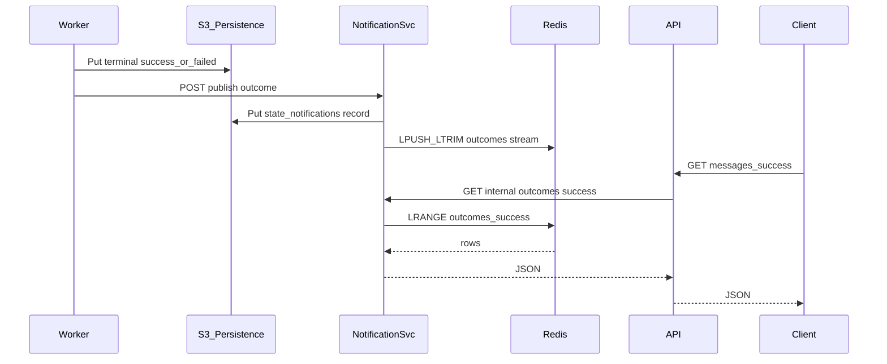

# NOTIFICATION_SERVICE.md - Outcomes notification service (architecture)

This document **closes the API recent-outcomes gap**: workers perform terminal `success` / `failed` writes in S3, while `GET /messages/success` and `GET /messages/failed` must **not** scan broad `state/success/` or `state/failed/` trees on every request ([`REST_API.md`](REST_API.md), [`PLAN.md`](PLAN.md) §7).

**Chosen approach:** two runtime pieces:

1. **Dedicated Redis container** — **hot cache** for recent terminal outcomes (fast reads, shared across processes).
2. **Dedicated notification service container** — accepts worker **publishes**, writes **durable** records to S3 (`state/notifications/...`), and **updates Redis**; serves **query** calls used by the REST API.

**Ordering:** terminal object **durably** in S3 **first** → **publish** to notification service → **S3 notification record** + **Redis** update.

The **REST API** does **not** connect to Redis directly; it **queries the notification service** (HTTP), which reads from **Redis** (encapsulates key schema and trimming).

---

## 1) Deployment topology

| Runtime | Role |
|---------|------|
| **Redis** (dedicated container, e.g. `redis:7-alpine`) | In-memory datastore for **recent outcome entries** (bounded length per stream). |
| **Notification service** (dedicated container, Python/async) | HTTP **publish** API for workers; HTTP **query** API for API service; S3 writes for durable log; **Redis client** for cache updates and reads. |
| **REST API** | `GET /messages/*` → **HTTP to notification service** (not Redis). |
| **Workers** | HTTP **publish** to notification service after terminal S3 success. |

**Configuration:** notification service uses e.g. `REDIS_URL=redis://redis:6379/0` (Kubernetes Service name `redis` in-cluster).

---

## 2) Responsibilities

| Actor | Responsibility |
|-------|----------------|
| **Worker** | After `state/success/...` or `state/failed/...` is durably written, **POST** publish to notification service (**retry** on transient failures). |
| **Notification service** | **Put** `state/notifications/...` JSON; **push** summary into **Redis** (trim to cap); answer **querySuccess|queryFailed** from Redis. |
| **REST API** | Delegate `GET /messages/success` and `GET /messages/failed` to notification service only—**no** `state/success/` / `state/failed/` listing. |
| **Redis** | Hold **bounded** lists or sorted sets for **success** and **failed** streams—**no business logic**. |
| **Persistence service** | All S3 I/O (notification objects) through the same boundary as the rest of the system. |

---

## 3) S3 layout for notification records (durable log)

**Prefix (required):**

`state/notifications/<yyyy>/<MM>/<dd>/<hh>/<notificationId>.json`

- **`notificationId`**: **ULID** or **UUID** (ULID preferred for **sortable** ids within an hour).
- **One object per** terminal publish event.

**Record body (minimum):**

```json
{
  "notificationId": "ulid-or-uuid",
  "messageId": "uuid",
  "outcome": "success",
  "recordedAt": 1700000000000,
  "shardId": 3
}
```

- `outcome`: **`success`** | **`failed`**
- `recordedAt`: epoch **milliseconds**

**Why this log exists:** **Hydration** after Redis flush / cold start / notification service redeploy without requiring scans of `state/success/` or `state/failed/`.

---

## 4) Redis data model (hot cache)

**Implementation must document exact key names; example:**

| Key / pattern | Type | Semantics |
|---------------|------|-----------|
| `outcomes:success` | **LIST** (JSON strings) or **ZSET** (score=`recordedAt`, member=payload) | **Newest-first** read path for success stream. |
| `outcomes:failed` | same | Failed stream. |

**Recommended:** **LIST** with **`LPUSH`** + **`LTRIM 0 MAX_ENTRIES-1`** where `MAX_ENTRIES` ≥ **`HYDRATION_MAX`** (e.g. **10,000**) and ≥ API **`max(limit)`**.

**Alternative:** **ZSET** with **`ZADD`** + **`ZREMRANGEBYRANK`** to cap size—good for strict time ordering.

**Dedupe:** same as before—**latest `recordedAt` wins** for a given `messageId` if duplicates appear (implement with auxiliary **`HSET`** `outcomes:by_message:<messageId>` → last notification id, or accept duplicate rows in LIST and dedupe on **read**—**document**).

**TTL:** optional **`EXPIRE`** on keys (exercise: usually **no TTL**, rely on **LTRIM**).

---

## 5) Publish path (worker → notification service)

**Trigger:** only after terminal **Put** to `state/success/...` or `state/failed/...` succeeds.

**HTTP** (recommended): `POST /internal/v1/outcomes` (private network; shared secret / mTLS in real deployments).

**Steps inside notification service (happy path):**

1. **Validate** payload (`messageId`, `outcome`, `recordedAt`, `notificationId`, …).
2. **Put** S3 object under `state/notifications/...` (persistence service).
3. **Pipeline Redis:** `LPUSH` appropriate list + `LTRIM` (or ZSET equivalent).
4. Return **2xx**.

**Partial failure:**

- S3 put **OK**, Redis **fail** → **retry** publish idempotently if same `notificationId` overwrites or skip duplicate S3 put; **document** reconciliation (e.g. **hydration** can rebuild Redis from S3).
- S3 put **fail** → **5xx** to worker; worker **retries** publish; terminal state already exists—second publish must be **idempotent** in S3 (`notificationId` deterministic or overwrite same key).

**Tests should cover:** S3 OK / Redis fail and eventual consistency via **re-publish** or **hydration**.

---

## 6) Query path (REST API → notification service → Redis)

- `GET` handler on API calls notification service: e.g. `GET /internal/v1/outcomes/success?limit=100`.
- Notification service **`LRANGE outcomes:success 0 limit-1`** (if LIST) or **`ZREVRANGE`** (if ZSET), parse JSON, return JSON array.

**Rules:**

- **No** listing `state/success/` or `state/failed/` for these responses.
- **No** Redis access from **API** process—only from **notification service**.

---

## 7) Startup hydration (~10k from S3 into Redis)

**When:** notification service **start** (after **Redis connection** healthy)—**before** marking **ready** (or serve **503** until hydration completes—**document**).

**Goal:** load up to **`HYDRATION_MAX`** (default **10,000**) **newest** notification records from S3 into **Redis** (same key layout as §4).

**Algorithm** (same spirit as before):

1. Walk **`state/notifications/<yyyy>/<MM>/<dd>/<hh>/`** from **current hour backward**, **list** + **get** with pagination.
2. Sort by **`recordedAt`** desc (or ULID desc), take **HYDRATION_MAX**.
3. **`DEL outcomes:success`** / **`DEL outcomes:failed`** (optional: **merge** if preserving multi-writer—exercise: **replace** on cold hydration) then **`RPUSH`** in chronological batch or **`LPUSH`** in reverse order so **`LRANGE 0 N-1`** returns newest first—**document** order contract.

**Frequency:** **once per notification-service startup**, not per user `GET`.

**Redis empty but running:** if Redis **persisted** RDB/AOF and data present, either **skip** full hydration or **merge** with cap—exercise default: **always re-hydrate from S3** on notification service boot to **match** S3 truth (simpler).

**Failure modes:**

- **Redis down:** notification service **readiness fails** or degraded; publish **retry**; API outcomes **503**.
- **S3 down during hydration:** bounded retry; then degraded empty cache or block readiness.

---

## 8) Scaling and replicas

- **Redis:** single primary for exercise (`replica=1`). **Redis Cluster** out of scope.
- **Notification service:** **≥1** replicas **safe for reads** if all **writes** are **idempotent** and share one Redis (duplicate `LPUSH` still needs dedupe policy). **Simplest:** **1 replica** for notification service to avoid double-processing publishes without distributed locks.
- **API:** can scale horizontally; each instance calls notification service **query** URL (load-balanced).

---

## 9) Observability

- Metrics: `notifications_published_total`, `notifications_redis_errors_total`, `hydration_records_loaded`, `hydration_duration_seconds`, Redis **latency** histogram on publish/query.
- Logs: `messageId`, `outcome`, `notificationId`, `redis_ok`, `s3_ok`.

---

## 10) Validation checklist

1. Terminal S3 write **before** publish.
2. **Dedicated Redis container** in compose/K8s manifests; notification service has **`REDIS_URL`**.
3. `GET /messages/*` never lists broad `state/success/` / `state/failed/`.
4. **Hydration** fills Redis up to **`HYDRATION_MAX`** from `state/notifications/...`.
5. **API** does not import Redis client for outcomes—only notification service does.
6. Publish **retries** do not corrupt terminal S3 or Redis beyond documented dedupe.

---

## 11) Conceptual flow



---

## 12) Local development

- **docker-compose:** `redis` + `notification-service` + dependencies; `REDIS_URL=redis://redis:6379/0`.
- **Tests:** **fakeredis** / **Redis testcontainer** for integration tests without a full cluster.
