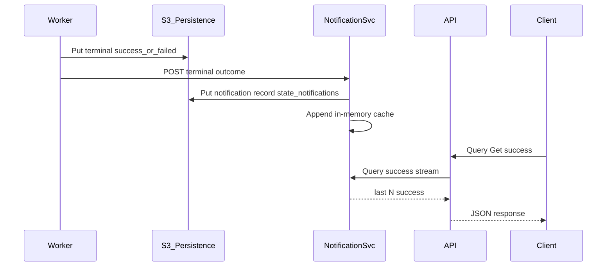

# NOTIFICATION_SERVICE.md - Outcomes notification service (architecture)

This document **closes the API recent-outcomes gap**: workers perform terminal `success` / `failed` writes in S3, while `GET /messages/success` and `GET /messages/failed` must **not** scan broad `state/success/` or `state/failed/` trees on every request ([`REST_API.md`](REST_API.md), [`PLAN.md`](PLAN.md) §7).

**Chosen approach:** a dedicated **notification service** with:

1. **In-memory bounded cache** of recent terminal outcomes (hot read path for the API).
2. **Durable notification records** in S3 (append-style, time-partitioned keys) so the service can **rebuild** memory after restart.
3. **Worker → notification service** calls after **successful** terminal persistence in S3 (ordering: **terminal write first**, then notify).

The **REST API** does **not** own the deque directly; it **queries** the notification service (in-process call, localhost HTTP, or UDS—implementation choice).

---

## 1) Responsibilities

| Actor | Responsibility |
|-------|----------------|
| **Worker** | After moving a message to `state/success/...` or `state/failed/...`, **publish** a terminal-outcome notification (with **retry** if the notification service is temporarily unavailable). |
| **Notification service** | Accept publishes; **append** durable record to S3; update **in-memory** structures so recent success/failed streams are available in **O(cache size)** time. |
| **REST API** | `GET /messages/success` and `GET /messages/failed` **read from** the notification service only—**no** listing of `state/success/` / `state/failed/` for those endpoints. |
| **Persistence service** | All S3 I/O for notification objects goes through the same boundary as the rest of the system. |

---

## 2) S3 layout for notification records (durable log)

**Prefix (required):**

`state/notifications/<yyyy>/<MM>/<dd>/<hh>/<notificationId>.json`

- **`notificationId`**: **UUID** or **ULID** (preferred for **time-sortable** lexicographic order within an hour folder).
- **One object per terminal outcome event** (success or failed).

**Record body (minimum):**

```json
{
  "notificationId": "ulid-or-uuid",
  "messageId": "uuid",
  "outcome": "success",
  "recordedAt": 1700000000000,
  "shardId": 3
}
```

- `outcome`: **`success`** | **`failed`**
- `recordedAt`: epoch **milliseconds** (server clock at publish time; used for hydration ordering).
- Optional fields: `attemptCount`, summary metadata—must not be required for `GET` recent outcomes if you keep responses minimal.

**Why not reuse `state/success/` keys as the log?**  
Those paths are keyed by **message lifecycle**, not an append-only **event stream**; listing “latest N terminals” would still require **wide** listing across date prefixes. The **`state/notifications/...`** tree is a **narrow, purpose-built** log for replay/hydration.

---

## 3) In-memory cache (hot path)

- **Bounded** structure: hold at least the **latest ~10,000** notifications **total** (config constant), or separate caps per outcome stream—**document** the chosen rule.
- **Eviction:** **FIFO** or **by `recordedAt`** so memory stays bounded when publish rate exceeds disk trim (exercise: 10k is plenty).
- **Serving `GET`:** Filter by `outcome`, sort by **`recordedAt` desc**, apply `limit` (default 100 per [`REST_API.md`](REST_API.md)).
- **Dedupe (recommended):** if the same `messageId` receives a second terminal publish (retry bug), **keep the latest** `recordedAt` for display **or** reject duplicate terminal for same id—**document** policy.

---

## 4) Startup hydration (~10k from S3)

**When:** notification service **process start** (before accepting traffic or parallel with readiness gate).

**Goal:** populate in-memory cache with up to **`HYDRATION_MAX`** records (default **10,000**), **newest first**.

**Algorithm (normative enough for implementation):**

1. Set `HYDRATION_MAX = 10000` (module constant).
2. Starting from **current** UTC `(yyyy, MM, dd, hh)`, iterate **hour buckets backward in time** (hour → previous hour → previous day as needed).
3. Within each bucket prefix `state/notifications/<yyyy>/<MM>/<dd>/<hh>/`, **list** keys with **pagination** (persistence service), sort by **`notificationId`** (ULID) or **`recordedAt`** after **GetObject** until the bucket’s contribution is ordered.
4. **Merge** into a **max-heap** or collect-then-sort-by-`recordedAt` until **`HYDRATION_MAX`** records are loaded **or** no more objects exist.
5. **Stop** early when memory cache is full—**do not** scan the entire bucket for exercise scale.

**Performance note:** This **is** multi-prefix **listing**, but it runs **once per notification-service restart**, not per `GET`. That satisfies the spirit of [`REST_API.md`](REST_API.md): user-facing reads stay off S3.

**Failure:** if hydration cannot complete (S3 down), service may enter **degraded** mode: empty cache + **503** on outcome endpoints, or **retry** hydration with bounded backoff—**document** choice.

---

## 5) Worker publish contract

**Trigger:** **only after** the terminal object exists in S3 under `state/success/...` or `state/failed/...` (same transaction order: **write terminal → then notify**).

**Transport (pick one and document):**

- **HTTP `POST`** to notification service (e.g. `POST /internal/v1/outcomes` with shared secret / mTLS in production; **open** on private network in exercise).
- **In-process** function call if worker and notification service share a **single binary** in tests (still keep boundaries in code).

**Payload:** align with §2 body (at least `messageId`, `outcome`, `recordedAt`, `notificationId`).

**Reliability:**

- **At-least-once** delivery is acceptable: duplicate publishes should be **deduped** (§3) or harmless.
- Implement **short retry with backoff** (e.g. 3 tries) if publish fails; **do not** roll back S3 terminal state if publish fails (terminal state is source of truth; notification can be **replayed** from a future admin tool or **backfill** from log—out of scope for minimal exercise).

---

## 6) API integration

- `GET /messages/success` → notification service **`querySuccess(limit)`**.
- `GET /messages/failed` → **`queryFailed(limit)`**.
- **No `ListBucket` on `state/success/` / `state/failed/`** in those handlers.

**Submission path:** when the API itself learns of an outcome **only** through workers, it **does not** need to push to the notification service **if** workers always publish—optional **dual publish** from API if activation is co-located (avoid if redundant).

---

## 7) Multi-replica considerations (exercise scope)

- **Single notification service replica** (or **single logical writer**): simplest; all workers point to one URL.
- **Multiple replicas** with **only in-memory** state: workers would need to **fan-out** to all replicas (impractical) or you add **Redis**/shared store—**out of scope** unless you extend the spec.
- **Recommendation for the interview:** **one** notification service Deployment **replica=1**, or **colocate** notification module inside the **API** process with **in-proc** calls from workers replaced by **HTTP to API sidecar** only if you split processes.

---

## 8) Observability

- Counters: `notifications_published_total`, `notifications_publish_failures_total`, `hydration_records_loaded`, `hydration_duration_seconds`.
- Logs: structured publish events with `messageId`, `outcome`, `notificationId`.

---

## 9) Validation checklist

1. Terminal S3 write happens **before** notification publish (happy path).
2. `GET /messages/*` **never** lists `state/success/` or `state/failed/` for assembly.
3. After notification service restart, hydrated cache contains **up to** `HYDRATION_MAX` **newest** notifications.
4. Publish failures are **retried** briefly; system does not **lose** S3 terminal state.
5. In-memory bounds enforced under load.

---

## 10) Conceptual flow


