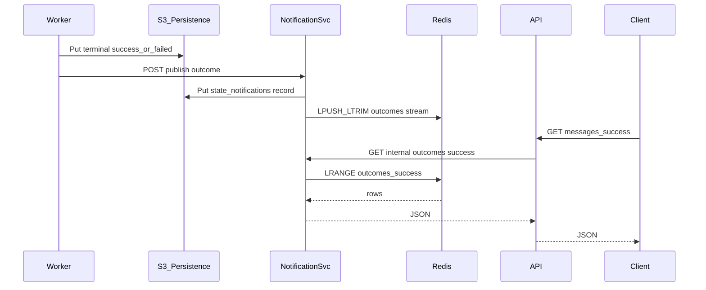

# NOTIFICATION_SERVICE.md - Outcomes notification service (architecture)

Aligned with [`plans/PLAN.md`](PLAN.md) §3/§7, [`plans/SYSTEM_OVERVIEW.md`](SYSTEM_OVERVIEW.md), [`plans/REST_API.md`](REST_API.md), [`plans/CORE_LIFECYCLE.md`](CORE_LIFECYCLE.md) §5.3, [`plans/RESILIENCE.md`](RESILIENCE.md) §7, and (orthogonal) [`plans/HEALTH_MONITOR.md`](HEALTH_MONITOR.md) for **mock-audit vs S3**. **Hot outcomes** behavior and **`OutcomesHotStore`** contracts are specified here; implementation lives under `src/inspectio_exercise/notification/`.

This document **closes the API recent-outcomes gap**: workers perform terminal `success` / `failed` writes in S3, while `GET /messages/success` and `GET /messages/failed` must **not** scan broad `state/success/` or `state/failed/` trees on every request ([`REST_API.md`](REST_API.md), [`PLAN.md`](PLAN.md) §7).

**Chosen approach:**

1. **Pluggable hot outcomes store (`OutcomesHotStore`)** inside the **notification service** — bounded **success** / **failed** streams (newest-first), **trimmed** to **`OUTCOMES_STREAM_MAX`**. Domain code (**publish**, **hydration**, **query** handlers) depends only on this port; **Redis** is the default **production** implementation (`OUTCOMES_STORE_BACKEND=redis`). An in-process **`memory`** backend exists for **tests** and **local** runs without a Redis container.
2. **Dedicated Redis container** (when `OUTCOMES_STORE_BACKEND=redis`) — shared **hot cache** across notification service processes (compose/K8s).
3. **Dedicated notification service container** — accepts worker **publishes**, writes **durable** records to S3 (`state/notifications/...`), and **updates the hot store**; serves **query** calls used by the REST API.

**Ordering:** terminal object **durably** in S3 **first** → **publish** to notification service → **S3 notification record** + **hot store** update.

The **REST API** does **not** connect to Redis or the hot store directly; it **queries the notification service** (HTTP), which reads through **`OutcomesHotStore`** (Redis plugin encapsulates key schema and LIST trimming; see §4).

---

## 1) Deployment topology

| Runtime | Role |
|---------|------|
| **Redis** (dedicated container when `OUTCOMES_STORE_BACKEND=redis`, e.g. `redis:7-alpine`) | External datastore for the **Redis** hot-store plugin (bounded streams per §4). |
| **Notification service** (dedicated container, Python/async) | HTTP **publish** API for workers; HTTP **query** API for API service; S3 writes for durable log; **`OutcomesHotStore`** implementation for cache updates and reads. |
| **REST API** | `GET /messages/*` → **HTTP to notification service** (not Redis / not hot store). |
| **Workers** | HTTP **publish** to notification service after terminal S3 success. |

**Configuration:**

- **`OUTCOMES_STORE_BACKEND`**: **`redis`** (default in production / docker-compose) or **`memory`** (in-process lists; suitable for unit tests and single-process dev).
- **`REDIS_URL`**: required when backend is **`redis`** (e.g. `redis://redis:6379/0` in-cluster).

---

## 2) Responsibilities

| Actor | Responsibility |
|-------|----------------|
| **Worker** | After `state/success/...` or `state/failed/...` is durably written, **POST** publish to notification service (**retry** on transient failures). |
| **Notification service** | **Put** `state/notifications/...` JSON; **push** summary into **hot store** (trim to cap); answer **querySuccess|queryFailed** from **hot store**. |
| **REST API** | Delegate `GET /messages/success` and `GET /messages/failed` to notification service only—**no** `state/success/` / `state/failed/` listing. |
| **Hot store backend** (e.g. **Redis** plugin) | Hold **bounded** lists or sorted sets for **success** and **failed** streams—**no business logic** in the store itself. |
| **Persistence service** | All S3 I/O (notification objects) through the same boundary as the rest of the system. |

---

## 3) S3 layout for notification records (durable log)

**Prefix (required):**

`state/notifications/<yyyy>/<MM>/<dd>/<hh>/<notificationId>.json`

- **Partition segments:** **`yyyy` / `MM` / `dd` / `hh`** from **UTC**, **24-hour** `hh`, zero-padded—derived from the notification’s **`recordedAt`** (or the wall-clock instant of the S3 put if you align them). Same rule as terminal success/failed keys in [`PLAN.md`](PLAN.md) §3.
- **`notificationId`**: **ULID** or **UUID** (ULID preferred for **sortable** ids within an hour).
- **One object per** terminal publish event.

**Record body (minimum):**

```json
{
  "notificationId": "ulid-or-uuid",
  "messageId": "uuid",
  "outcome": "success",
  "recordedAt": 1700000000000,
  "shardId": 3
}
```

- `outcome`: **`success`** | **`failed`**
- `recordedAt`: epoch **milliseconds** (UTC instant); **must** be consistent with the **UTC** key segments above (same moment).

**Why this log exists:** **Hydration** after hot cache flush / cold start / notification service redeploy without requiring scans of `state/success/` or `state/failed/`.

---

## 3.1) Hot store port (`OutcomesHotStore`)

The notification service uses a small **async port** (prepend + trim per stream, clear both streams, range reads newest-first, `ping`, `aclose`), plus **shared hydration coordination** for horizontal scale:

- **`begin_shared_hydration_if_leader()`** → **`bool`**: returns **`True`** only on instances that should run the **destructive** S3 scan and rebuild of Redis lists. With **`OUTCOMES_STORE_BACKEND=redis`**, the reference implementation uses a **Redis `SET key NX` lock** (TTL) and a **short wait/retry** loop so **at most one pod** clears and repopulates shared lists while peers observe populated lists or take over if the leader stalls. The **`memory`** backend always returns **`True`** (single-process).
- **`end_shared_hydration()`**: releases the leader lock after hydration completes or is skipped (Redis); no-op for **memory**.

**Redis** and **memory** implementations ship in-repo; additional backends (e.g. another KV) implement the same contract.

- **Errors:** store failures surface as **`OutcomesStoreError`** (or equivalent) so HTTP handlers stay free of `redis` imports.
- **Reference LIST semantics:** the **Redis** plugin uses **`LPUSH`** + **`LTRIM`** + **`LRANGE`** as specified in §4; the **memory** plugin mirrors that ordering for tests.

---

## 4) Redis data model (hot cache — reference implementation)

**When `OUTCOMES_STORE_BACKEND=redis`,** the service uses this schema. **Implementation must document exact key names; example:**

| Key / pattern | Type | Semantics |
|---------------|------|-----------|
| `outcomes:success` | **LIST** (JSON strings) or **ZSET** (score=`recordedAt`, member=payload) | **Newest-first** read path for success stream. |
| `outcomes:failed` | same | Failed stream. |

**Recommended:** **LIST** with **`LPUSH`** + **`LTRIM 0 MAX_ENTRIES-1`** where `MAX_ENTRIES` ≥ **`HYDRATION_MAX`** (e.g. **10,000**) and ≥ API **`max(limit)`**.

**Alternative:** **ZSET** with **`ZADD`** + **`ZREMRANGEBYRANK`** to cap size—good for strict time ordering.

**Dedupe:** same as before—**latest `recordedAt` wins** for a given `messageId` if duplicates appear (implement with auxiliary **`HSET`** `outcomes:by_message:<messageId>` → last notification id, or accept duplicate rows in LIST and dedupe on **read**—**document**).

**TTL:** optional **`EXPIRE`** on keys (exercise: usually **no TTL**, rely on **LTRIM**).

---

## 5) Publish path (worker → notification service)

**Trigger:** only after terminal **Put** to `state/success/...` or `state/failed/...` succeeds.

**HTTP** (recommended): `POST /internal/v1/outcomes` (private network; shared secret / mTLS in real deployments).

**Steps inside notification service (happy path):**

1. **Validate** payload (`messageId`, `outcome`, `recordedAt`, `notificationId`, …).
2. **Put** S3 object under `state/notifications/...` (persistence service).
3. **Update hot store** (Redis plugin: **pipeline** `LPUSH` appropriate list + `LTRIM`, or ZSET equivalent if you adopt §4 alternative).
4. Return **2xx**.

**Partial failure:**

- S3 put **OK**, **hot store** **fail** → **retry** publish idempotently if same `notificationId` overwrites or skip duplicate S3 put; **document** reconciliation (e.g. **hydration** can rebuild the cache from S3).
- S3 put **fail** → **5xx** to worker; worker **retries** publish; terminal state already exists—second publish must be **idempotent** in S3 (`notificationId` deterministic or overwrite same key).

**Tests should cover:** S3 OK / hot-store fail and eventual consistency via **re-publish** or **hydration** (Redis adapter tests may use **fakeredis**).

---

## 6) Query path (REST API → notification service → hot store)

- `GET` handler on API calls notification service: e.g. `GET /internal/v1/outcomes/success?limit=100`.
- Notification service reads via **`OutcomesHotStore`** (Redis plugin: **`LRANGE outcomes:success 0 limit-1`** if LIST, or **`ZREVRANGE`** if ZSET), parse JSON, return JSON array.

**Rules:**

- **No** listing `state/success/` or `state/failed/` for these responses.
- **No** Redis or hot-store access from **API** process—only from **notification service**.

---

## 7) Startup hydration (~10k from S3 into hot store)

**When:** notification service **start** (after **hot store** is reachable — e.g. **`ping`** for Redis backend)—**before** marking **ready** (or serve **503** until hydration completes—**document**).

**Goal:** load up to **`HYDRATION_MAX`** (default **10,000**) **newest** notification records from S3 into the **hot store** (Redis plugin: same key layout as §4).

**Algorithm** (same spirit as before):

1. Walk **`state/notifications/<yyyy>/<MM>/<dd>/<hh>/`** from **current hour backward**, **list** + **get** with pagination.
2. Sort by **`recordedAt`** desc (or ULID desc), take **HYDRATION_MAX**.
3. **`DEL outcomes:success`** / **`DEL outcomes:failed`** (optional: **merge** if preserving multi-writer—exercise: **replace** on cold hydration) then **`RPUSH`** in chronological batch or **`LPUSH`** in reverse order so **`LRANGE 0 N-1`** returns newest first—**document** order contract.

**Frequency:** **once per notification-service process startup**, not per user `GET`. With **multiple notification pods** sharing one Redis, **only the hydration leader** runs the **`clear_all_streams` + list rebuild** path; **followers** skip the body of hydration (lists already filled by the leader, or they wait briefly for a peer—see §3.1 / §8).

**Redis empty but running** (when using Redis backend): if Redis **persisted** RDB/AOF and data present, either **skip** full hydration or **merge** with cap—exercise default: **always re-hydrate from S3** on notification service boot to **match** S3 truth (simpler).

**Failure modes:**

- **Hot store down** (e.g. **Redis** unavailable with `OUTCOMES_STORE_BACKEND=redis`): notification service **readiness fails** or degraded; publish **retry**; API outcomes **503**.
- **S3 down during hydration:** bounded retry; then degraded empty cache or block readiness.

---

## 8) Scaling and replicas

- **Redis:** single primary for exercise (`replica=1`). **Redis Cluster** out of scope.
- **Notification service:** **≥1** replicas **safe** when all instances share **one** Redis **`OutcomesHotStore`** and **publishes** remain **idempotent** on **`notificationId`** (S3 put + **`LPUSH`** semantics). **Hydration** must **not** run destructive **`DEL`/rebuild on every pod concurrently:** use **`begin_shared_hydration_if_leader` / `end_shared_hydration`** (§3.1) so **one** pod repopulates shared lists per cold start wave. **Configuration (reference implementation):**
  - **`INSPECTIO_NOTIFICATION_HYDRATION_LOCK_KEY`** — Redis key for **`SET NX`** (default `inspectio:outcomes:hydration-lock`).
  - **`INSPECTIO_NOTIFICATION_HYDRATION_LOCK_TTL_SEC`** — lock TTL seconds (default **600**).
  - **`INSPECTIO_NOTIFICATION_HYDRATION_WAIT_PEER_SEC`** — how long a non-leader waits for lists to populate before retrying lock (default **120**).
- **API:** can scale horizontally; each instance calls notification service **query** URL (load-balanced).

---

## 9) Observability

- Metrics: `notifications_published_total`, `notifications_store_errors_total` (or `notifications_redis_errors_total` when Redis-specific), `hydration_records_loaded`, `hydration_duration_seconds`, store **latency** histogram on publish/query.
- Logs: `messageId`, `outcome`, `notificationId`, `store_ok` / `redis_ok`, `s3_ok`.

---

## 10) Validation checklist

1. Terminal S3 write **before** publish.
2. **`OUTCOMES_STORE_BACKEND`** set appropriately; **`redis`** + **`REDIS_URL`** in compose/K8s when using the Redis plugin.
3. `GET /messages/*` never lists broad `state/success/` / `state/failed/`.
4. **Hydration** fills the **hot store** up to **`HYDRATION_MAX`** from `state/notifications/...`.
5. **API** does not import Redis or **`OutcomesHotStore`** for outcomes—only the **notification service** uses the hot store (through its chosen backend).
6. Publish **retries** do not corrupt terminal S3 or the hot cache beyond documented dedupe.
7. **Multiple notification pods** + **Redis**: **hydration** uses **leader election** (§3.1 / §8) so concurrent startups do not each **`DEL`** and race-rebuild the shared outcome lists.

---

## 11) Conceptual flow



---

## 12) Local development

- **docker-compose:** `redis` + `notification` + dependencies; `OUTCOMES_STORE_BACKEND=redis`, `REDIS_URL=redis://redis:6379/0`.
- **Tests without Redis:** set **`OUTCOMES_STORE_BACKEND=memory`** or inject a test **`OutcomesHotStore`** (e.g. **Redis** adapter over **fakeredis**).
- **Optional:** **Redis testcontainer** for integration tests that exercise a real Redis wire protocol.
