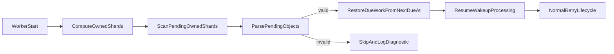

# RESILIENCE.md - Detailed Plan (Section 6)

This document provides a detailed requirements-level plan for Section 6: crash resilience.

It is aligned with:
- `plans/PLAN.md`
- `plans/SYSTEM_OVERVIEW.md`
- `plans/SHARDING.md`
- `plans/CORE_LIFECYCLE.md`

## 1) Scope

In scope:
- Worker restart/crash recovery requirements
- Startup bootstrap behavior from persisted pending state
- Recovery correctness guarantees (no lost retries, no ordering regression)
- Recovery-time failure handling and observability
- Resilience validation checklist

Out of scope:
- API endpoint definitions
- Shard formula derivation details (covered in `plans/SHARDING.md`)
- Retry timeline definition itself (covered in `plans/CORE_LIFECYCLE.md`)

## 2) Core resilience objective

The system must tolerate worker crashes/restarts without losing retry work:
- Pending messages must remain recoverable from durable persistence.
- On restart, workers must restore due-work scheduling from persisted state.
- Processing resumes without dropping eligible retries or violating terminal-state rules.
- After bootstrap, scheduler cadence must resume at the architect-required exact 500ms tick.

## 3) Startup bootstrap requirements

On worker startup:

1. Compute owned shard range from `HOSTNAME` and shard ownership config.
2. Scan only owned pending prefixes:
   - `state/pending/shard-<shard_id>/`
3. Load pending message records and restore scheduling from persisted `nextDueAt`.
4. Resume normal wakeup cadence and due processing.

Mandatory constraints:
- No global scan across unowned shards.
- Bootstrap is deterministic and repeatable.
- Recovery logic runs through the dedicated S3 persistence service boundary.
- `state/pending/shard-<shard_id>/` is the canonical pending shard prefix naming used for resilience behavior.

## 4) Recovery correctness requirements

### 4.1 No-loss guarantee for persisted pending work

If a message is persisted under owned pending keys before crash:
- It must be discoverable during startup scan.
- It must re-enter due processing according to persisted `nextDueAt`.

### 4.2 Ordering and due-time integrity

- Restored scheduling must preserve due-time semantics from persisted `nextDueAt`.
- Due-work priority ordering must be reconstructed using earliest-due-first semantics (Min-Heap-compatible).

### 4.3 Terminal-state safety

- Messages already transitioned to terminal success/failed state must not re-enter pending processing.
- Recovery path must prevent duplicate terminal side effects for a `messageId`.
- Local idempotency cache (if used) must be rehydrated or safely reset from persisted state on startup so stale cache state cannot invalidate recovery.

## 5) Failure handling during bootstrap

While scanning and restoring pending objects:

- For malformed or incomplete records:
  - skip safely
  - emit structured diagnostic log (`messageId` if available, shard, reason)
  - increment invalid-record metric
- For transient persistence read failures:
  - retry with bounded backoff policy
  - surface startup-degraded signal if thresholds are exceeded

The worker should enter normal processing only after owned shard bootstrap has completed to a consistent recovery checkpoint.

## 6) Resilience under scaling/restarts

### 6.1 Pod restarts

- Restarted pod re-derives ownership from current config and resumes from persistence.
- No manual replay should be required for pending work in owned shards.

### 6.2 Replica count changes

- Ownership ranges may shift after scale events.
- Each worker processes only currently owned shards after recomputation.
- Idempotency and persistence-backed state are required safety nets during ownership transitions.

### 6.3 TOTAL_SHARDS changes

- Treated as migration events, not dynamic runtime toggles.
- Must include explicit remapping strategy and compatibility plan.

## 7) Outcomes notification service — startup / recovery

The **notification service** ([`NOTIFICATION_SERVICE.md`](NOTIFICATION_SERVICE.md)) must:

- On process start, after the **hot store** is reachable (e.g. **`ping`** when using the Redis backend), run **hydration**: load up to **`HYDRATION_MAX`** (default **10,000**) **newest** notification records from `state/notifications/...` via the persistence service and **write them into the hot store**—**before** treating the service as **ready** (or document degraded mode). With **several notification replicas** sharing Redis, only the **hydration leader** performs **`clear_all_streams` + rebuild**; other pods skip or wait per [`NOTIFICATION_SERVICE.md`](NOTIFICATION_SERVICE.md) §3.1 / §8.
- Use **bounded** pagination when listing hour prefixes; **do not** assume unbounded RAM in the notification service **process** (the **hot store** backend—e.g. **Redis**—holds the shared cache when using that plugin).
- If the **hot store** is unavailable (e.g. **Redis** down with `OUTCOMES_STORE_BACKEND=redis`): **readiness** fails or **degraded** mode (no publish / query)—**document**.
- If hydration fails after retries: emit **startup-degraded** telemetry; outcome `GET` endpoints may **503** or return **empty** until recovered—**document** the choice.

**Note:** Worker pods follow the existing pending-shard bootstrap rules in §3; this section applies to the **notification service process**, not worker scheduling.

## 8) Observability requirements for resilience

Startup and recovery telemetry must include:
- `hostname`, `pod_index`, owned shard range
- bootstrap start/end timestamps
- scanned pending object counts per shard
- restored due-work counts per shard
- invalid/malformed/skipped counts
- bootstrap retries/failures

Recovery health indicators:
- bootstrap completion status
- time-to-recovery metric
- backlog-at-recovery metric (pending count at startup)

## 9) Validation checklist

A resilience implementation is valid when:

1. Restarted worker scans only owned pending shard prefixes.
2. Persisted pending messages reappear in scheduling after restart.
3. Restored due processing respects persisted `nextDueAt`.
4. Terminal messages are not reprocessed as pending.
5. Malformed records are skipped safely with diagnostics.
6. Recovery metrics/logs are sufficient to diagnose startup behavior.
7. Scale/restart events do not cause silent pending message loss.
8. After notification service restart, **hydration** restores the **hot store** up to **`HYDRATION_MAX`** per [`NOTIFICATION_SERVICE.md`](NOTIFICATION_SERVICE.md) §7 (or documented degraded behavior).

## 10) Conceptual resilience flow

