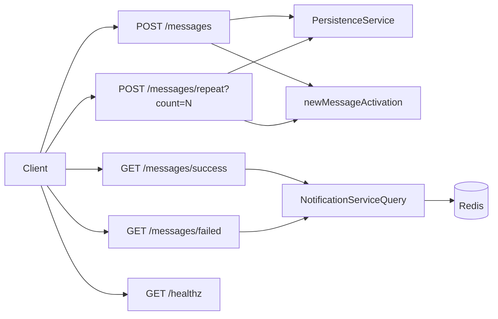

# REST_API.md - Detailed Plan (Section 7)

This document provides a detailed requirements-level plan for Section 7: REST API surface.

It is aligned with:
- `plans/PLAN.md`
- `plans/SYSTEM_OVERVIEW.md`
- `plans/CORE_LIFECYCLE.md`
- `plans/RESILIENCE.md`
- `plans/NOTIFICATION_SERVICE.md`
- `plans/HEALTH_MONITOR.md` (separate service; **not** part of this API surface unless you explicitly add an internal proxy—document if so)

## 1) Scope

In scope:
- API endpoints and responsibilities for Section 7
- Request/response behavior and constraints
- Recent outcomes performance requirements
- API-level observability and validation criteria

Out of scope:
- Worker internals and retry scheduler implementation details
- Shard ownership math details
- UI behavior beyond API contract expectations
- **SMS/S3 integrity `POST`** on the **health monitor** container ([`HEALTH_MONITOR.md`](HEALTH_MONITOR.md) §4)—that endpoint is **not** required on the public REST API unless you choose to forward it (then document auth and coupling)

## 2) API responsibilities

The REST API service must:
- Accept message submission requests.
- Trigger message activation flow (attempt #1 immediate path is handled by lifecycle flow).
- Expose recent successful and failed outcomes by **querying the outcomes notification service** ([`NOTIFICATION_SERVICE.md`](NOTIFICATION_SERVICE.md))—**not** by listing broad `state/success/` or `state/failed/` prefixes on each request.
- Expose service health status.
- Enforce input validation and deterministic response contracts.

All persistence operations are performed through the dedicated S3 persistence service boundary (no direct persistence bypass).

**S3 path time rule:** any date-partitioned keys written on behalf of the API (pending creation is not date-partitioned; terminal moves are worker-owned) follow **UTC** segments for success/failed/notification paths per [`PLAN.md`](PLAN.md) §3—implementations must not introduce local-TZ terminal keys.

## 3) Required endpoints (Section 7)

### 3.1 `POST /messages`

Purpose:
- Submit a single message for processing.

Request body (JSON):
- `body` (required): string — SMS text (non-empty).
- `to` (optional): string — destination phone or E.164 address; defaults to **`+10000000000`** when omitted.

The persisted pending object uses **`payload.to`** / **`payload.body`** in S3 (see [`PLAN.md`](PLAN.md) §3); the REST field **`to`** is stored as **`payload.to`**.

Response expectations:
- Returns accepted message metadata (including `messageId`).
- Response indicates initial lifecycle status (`pending`) or accepted processing state.

Validation expectations:
- Reject malformed or empty payload fields.
- Enforce schema-level validation before persistence/activation.

### 3.2 `POST /messages/repeat?count=N`

Purpose:
- Load-test helper endpoint to create **`N`** messages from **one** template.

Query parameters:
- `count` (required): positive integer, bounded by a configured **maximum** (e.g. `REPEAT_COUNT_MAX`) to prevent abuse.

Request body (JSON):
- Same fields as **`POST /messages`** (§3.1): **`to`** (optional, default **`+10000000000`**) and **`body`** (required, non-empty). This object is **reused `count` times**: each iteration creates an **independent** `messageId` and pending record with the same `to` / `body` payload.

Behavior:
- Creates **`count`** independent messages with distinct `messageId`s.
- Each created message enters normal lifecycle flow.

Response expectations:
- Returns summary of accepted count and identifiers or aggregate acceptance metadata.

### 3.3 `GET /messages/success`

Purpose:
- Return the most recent successful outcomes.

Query parameters:
- `limit` (optional): how many most-recent success records to return.
  - If omitted, default **`limit=100`** (matches the architect’s documented example).
  - If provided, must be a positive integer; API may enforce a configured **maximum** (e.g. cap at 100 or another agreed upper bound) and clamp or reject out-of-range values.
- `to` (optional): defaults to **`+10000000000`**. Reserved for future filtering; responses are unchanged until the notification/query layer supports it.

Performance requirement:
- Must serve from the **notification service**, which reads **Redis** (see [`NOTIFICATION_SERVICE.md`](NOTIFICATION_SERVICE.md) §4, §6).
- Must not list broad `state/success/` or `state/failed/` prefixes to assemble the response.

### 3.4 `GET /messages/failed`

Purpose:
- Return the most recent failed outcomes.

Query parameters:
- `limit` (optional): how many most-recent failure records to return.
  - If omitted, default **`limit=100`**.
  - If provided, must be a positive integer; same maximum/clamp policy as success endpoint.
- `to` (optional): defaults to **`+10000000000`**. Same semantics as §3.3.

Performance requirement:
- Must serve from the **notification service** (same as §3.3).
- Must not list broad `state/success/` or `state/failed/` prefixes to assemble the response.

### 3.5 `GET /healthz`

Purpose:
- Liveness/readiness style health signal for API service.

**Why `/healthz` and not `/health`?**
- The architect spec in `plans/PLAN.md` explicitly names **`GET /healthz`** for this exercise, so the contract matches that requirement.
- Separately, `/healthz` is a widely used convention for simple “up” probes (historically common in Kubernetes/GCP-style examples); `/health` is also common but not interchangeable unless you document both—here we stick to **`/healthz`** as the canonical path.

Response expectation:
- Fast, lightweight response indicating service health status.
- Clarify in implementation whether this is **liveness-only** (process up) vs **readiness** (dependencies OK); the exercise minimum is a lightweight liveness-style response unless you extend the spec.

## 4) Recent outcomes (notification service + Redis)

Recent outcomes are **not** stored in the **API** process. They live in **Redis** (dedicated container), updated by the **outcomes notification service** ([`NOTIFICATION_SERVICE.md`](NOTIFICATION_SERVICE.md)):

- **Redis** holds **bounded** **success** and **failed** streams (e.g. **LIST** or **ZSET**, **~10,000** entries cap)—large enough for the API’s **maximum `limit`** (including default **100** when `limit` is omitted).
- Workers **publish** to the **notification service** **after** durable terminal S3 writes; the service **puts** `state/notifications/...` and **updates Redis**.
- The API **queries the notification service** (HTTP) for `GET /messages/success` and `GET /messages/failed`—the API **must not** use a Redis client for outcomes.
- **Startup:** the notification service **hydrates Redis** from **`state/notifications/...`** in S3 (up to **`HYDRATION_MAX`**, default 10k). That **cold-start** scan is **not** executed per `GET` request.
- **Per-request rule:** outcome endpoints must **not** list broad `state/success/` or `state/failed/` trees to build the response.

## 5) API contract consistency requirements

### 5.1 Deterministic response shape

For each endpoint:
- Response schema must be stable and documented.
- Error responses should use consistent structure with machine-readable code + message.

### 5.2 Idempotency and duplicate-submission safety

At API boundary:
- Duplicate submissions should not create ambiguous response behavior.
- Lifecycle idempotency guarantees must be preserved downstream.

### 5.3 Validation and error handling

Common invalid cases:
- Missing required fields (`body` on `POST /messages`; **`count`** query on `POST /messages/repeat?count=…`)
- Empty `to` when provided
- Invalid `count`/`limit` values
- Unsupported types

API should return clear client errors for invalid input and structured server errors for internal failures.

## 6) Observability requirements (API-focused)

Structured logs should include:
- request id / correlation id
- endpoint path + method
- latency
- status code
- `messageId` where applicable
- `count` or `limit` where applicable

Minimum API metrics:
- request rate per endpoint
- response code distribution
- p50/p95 latency per endpoint
- recent-cache hit/miss ratio for outcomes endpoints
- validation failure counts

## 7) Security and operational guardrails

Requirements:
- Input bounds for `count` and `limit` to mitigate abuse.
- Avoid returning sensitive/internal persistence details in responses.
- Keep health endpoint lightweight and safe for frequent probing.

## 8) Validation checklist

The REST API plan is considered complete when:

1. All required endpoints are defined and scoped.
2. Input validation expectations are explicit for each endpoint class.
3. Recent outcomes are served via the **notification service** + **Redis** ([`NOTIFICATION_SERVICE.md`](NOTIFICATION_SERVICE.md)) with bounded streams and documented **S3 → Redis** hydration on notification service startup.
4. No-broad-`state/success/` / `state/failed/` listing on each `GET` for outcomes is explicit.
5. Response/error contract consistency is defined.
6. API observability and operational guardrails are included.

## 9) Conceptual endpoint flow

