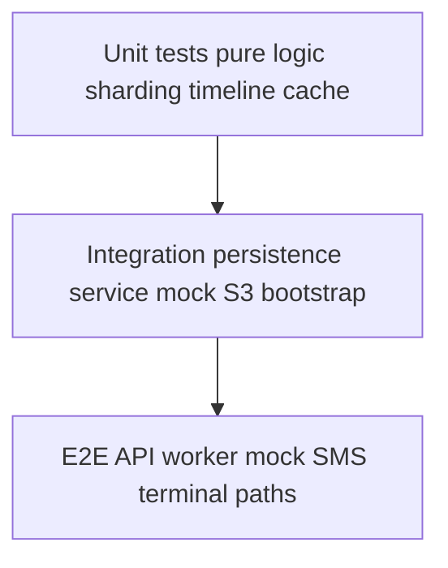

# TESTS.md - Detailed Plan (Section 9)

This document expands **Section 9** of [`plans/PLAN.md`](PLAN.md): **testing** for the SMS retry scheduler exercise. It aligns with [`plans/CORE_LIFECYCLE.md`](CORE_LIFECYCLE.md), [`plans/SHARDING.md`](SHARDING.md), [`plans/RESILIENCE.md`](RESILIENCE.md), [`plans/REST_API.md`](REST_API.md), and [`plans/MOCK_SMS.md`](MOCK_SMS.md).

## 1) Goals

- Prove **deterministic** behavior where the spec is deterministic (sharding, retry delays, ownership).
- Prove **lifecycle correctness** (pending → success / terminal failed) and **no broad S3 listing** for recent outcomes.
- Prove **resilience**: owned-shard bootstrap restores due work from persisted `nextDueAt` after restart.
- Keep tests **fast**, **repeatable**, and **isolated**—no reliance on real AWS or real SMS.

## 2) Out of scope (for this exercise)

- Production load/chaos testing at tens-of-thousands RPS.
- Multi-region S3 semantics, IAM policy proofs.
- Kubernetes e2e in CI (optional locally); **in-process** or **docker-compose** style tests are enough if documented.

## 3) Tooling assumptions (recommended)

- **pytest** + **pytest-asyncio** for async units and integration hooks.
- **time control**: fake clocks or injectable `now()` / monotonic time source so wakeup and `nextDueAt` tests are not flaky.
- **S3 simulation**: **moto** or **LocalStack**, **or** the planned **file-backed mock S3** behind the persistence service interface (preferred for speed if available).
- **HTTP mocking** for mock SMS: **httpx/ASGI test client**, **respx**, or a **test double** implementing `POST /send` with **`2xx`** / **`5xx`** outcomes (see [`MOCK_SMS.md`](MOCK_SMS.md)).

## 4) Unit tests (required areas)

### 4.1 Sharding and ownership

Cover (see [`SHARDING.md`](SHARDING.md)):

- **Stable shard id**: same `messageId` + `TOTAL_SHARDS` → same `shard_id` (deterministic hash).
- **Range mapping**: given `pod_index` and `shards_per_pod`, owned shard set matches `range(pod_index * shards_per_pod, (pod_index + 1) * shards_per_pod)`.
- **Out-of-range guard**: messages whose `shard_id` is not owned must be **ignored** for processing decisions (no writes to foreign pending prefixes).

### 4.2 Retry timeline and `nextDueAt`

Cover [`plans/PLAN.md`](PLAN.md) timeline relative to **previous attempt** time:

- For each failure at `attemptCount` **before** terminal, computed `nextDueAt` matches: **+0.5s, +2s, +4s, +8s, +16s** for the architect’s attempt **#2 … #6** mapping (align implementation’s `attemptCount` convention with [`CORE_LIFECYCLE.md`](CORE_LIFECYCLE.md) §4).
- **Terminal**: when threshold is met (`attemptCount == 6` per current spec), **no further** `nextDueAt` scheduling—transition to **failed** terminal key layout.

### 4.3 Wakeup / due selection

Cover [`CORE_LIFECYCLE.md`](CORE_LIFECYCLE.md) §4:

- On a tick at time `T`, only messages with **`nextDueAt <= T`** are eligible.
- **Ordering**: due work is consumed in **earliest-`nextDueAt`-first** order (Min-Heap–compatible semantics).
- **Concurrency**: multiple due messages in one tick can be dispatched concurrently **without** breaking idempotency or terminal transitions.

### 4.4 S3 state transitions (logic layer)

Test the **persistence orchestration** (via service mocks/fakes) for:

- **Success**: pending object removed (or no longer authoritative) and **success** key written under `state/success/<yyyy>/<MM>/<dd>/<hh>/<messageId>.json`.
- **Retry**: pending key updated with new `attemptCount` / `nextDueAt`, still under `state/pending/shard-<shard_id>/`.
- **Terminal failure**: pending removed and **failed** key under `state/failed/<yyyy>/<MM>/<dd>/<hh>/<messageId>.json`.

Use a **fake persistence layer** or **moto** with the same key rules as [`SHARDING.md`](SHARDING.md) §2.2.

### 4.5 Recent outcomes cache (API-side)

Cover [`REST_API.md`](REST_API.md) and [`PLAN.md`](PLAN.md) §7:

- **Bounded size** (e.g. maxlen **100** total or per stream—document chosen rule and test it).
- **No S3 prefix scan** when serving `GET /messages/success` / `GET /messages/failed`: assert the handler does **not** call list operations (mock/spy on persistence client).
- **`limit`**: optional query param with **default 100**; clamp/reject invalid values per REST plan.

### 4.6 Mock SMS contract (client or micro-module)

Cover [`MOCK_SMS.md`](MOCK_SMS.md):

- Worker treats **`2xx`** as success, **any `5xx`** as failed send.
- Optional: with mock app under test (or test client), **`shouldFail: true`** → always **`5xx`**.
- Optional: with **`RNG_SEED`** set in mock module for tests, intermittent outcomes are **reproducible**.

### 4.7 REST validation (pure / handler-level)

Cover [`REST_API.md`](REST_API.md):

- `POST /messages`: reject empty/malformed `to`/`body`.
- `POST /messages/repeat`: reject invalid `count`; enforce upper bound behavior.
- `GET /messages/*`: invalid `limit` yields **4xx** per spec.

## 5) Integration tests (required)

### 5.1 Persistence service + S3 simulation

- All reads/writes go through the **dedicated persistence service** boundary (no ad-hoc S3 client in tests outside that layer).
- Verify create/read/update/list **only within owned prefixes** where applicable.

### 5.2 Worker bootstrap / resilience

Cover [`RESILIENCE.md`](RESILIENCE.md):

- Seed pending keys under `state/pending/shard-<shard_id>/` with varied `nextDueAt`.
- Start worker (or run bootstrap function): assert in-memory scheduler matches persisted **due** state.
- **Malformed** JSON/object: skipped with no crash; metrics/log hooks may be asserted via spies.

### 5.3 API → pending → activation path

- `POST /messages` results in durable pending under the **correct** `shard-<shard_id>/` for the message’s `messageId`.
- Worker (or test harness) runs **attempt #1** path: mock SMS **`2xx`** leads toward success; **`5xx`** leads to updated pending / scheduled retry per timeline.

## 6) End-to-end tests (strongly recommended)

Compose **API + worker scheduler + persistence (mock S3) + mock SMS HTTP**:

- **Happy path**: message eventually **`2xx`** from SMS mock → **success** terminal key + appears in recent-success cache policy (if wired in test).
- **Retry path**: SMS mock returns **`5xx`** on first attempts, then **`2xx`** → pending updates until success.
- **Terminal failure**: SMS always **`5xx`** (or `shouldFail` + high `FAILURE_RATE` in test module) until **`attemptCount == 6`** → **failed** terminal key.
- **Restart**: after persisting a mid-retry pending state, **restart worker** / re-run bootstrap → message is still retried at **`nextDueAt`** (no silent loss).

## 7) Determinism and flakiness guardrails

- **Do not** depend on real wall-clock sleep for correctness tests; use injected time or short timeouts only in e2e smoke.
- **Mock SMS**: use **`RNG_SEED`** or stub the HTTP client for precise failure sequences.
- **IDs**: use fixed UUIDs in golden tests where helpful.

## 8) Traceability (requirements → coverage)

When implementing, map tests to spec sections:

- **Sharding**: `SHARDING.md` checklists.
- **Lifecycle / 500ms / concurrency**: `CORE_LIFECYCLE.md` §8 checklist.
- **Bootstrap**: `RESILIENCE.md` §8 checklist.
- **REST**: `REST_API.md` §8 checklist.
- **Mock SMS**: `MOCK_SMS.md` §10 checklist.

## 9) CI expectations (exercise)

- **Unit** suite runs on every change (fast, no Docker dependency if possible).
- **Integration** suite may start LocalStack/moto or use file-backed mock **in process**.
- Document any **skipped** tests (e.g. optional K8s e2e) with reason.

## 10) Validation checklist (this testing plan)

Section 9 testing work is complete when:

1. Unit tests exist for **shard ownership**, **retry timeline**, **wakeup selection**, and **terminal rules**.
2. Unit/integration tests prove **persistence key paths** for pending/success/failed.
3. Recent-outcomes behavior is covered **without** relying on S3 listing in the read path.
4. At least one **multi-component** test covers **API → pending → worker → mock SMS → terminal state**.
5. At least one test proves **bootstrap after restart** restores due work from owned pending shards.
6. Testing approach and how to run suites are documented in the repo **README** (or `CONTRIBUTING`) once implementation exists.

## 11) Conceptual test layers

