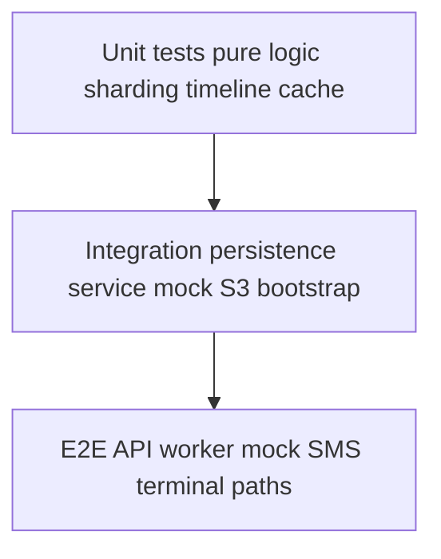

# TESTS.md - Detailed Plan (Section 9)

This document expands **Section 9** of [`plans/PLAN.md`](PLAN.md): **testing** for the SMS retry scheduler exercise. It aligns with [`plans/SYSTEM_OVERVIEW.md`](SYSTEM_OVERVIEW.md), [`plans/CORE_LIFECYCLE.md`](CORE_LIFECYCLE.md), [`plans/SHARDING.md`](SHARDING.md), [`plans/RESILIENCE.md`](RESILIENCE.md), [`plans/REST_API.md`](REST_API.md), and [`plans/MOCK_SMS.md`](MOCK_SMS.md).

**Enumerated checklist:** [`plans/TEST_LIST.md`](TEST_LIST.md) (full test case IDs, edge cases, 9.1 companion).

## 1) Goals

- Prove **deterministic** behavior where the spec is deterministic (sharding, retry delays, ownership, **500ms** tick semantics).
- Prove **lifecycle correctness** (pending → success / terminal failed) and **no broad S3 listing** for recent outcomes.
- Prove **resilience**: owned-shard bootstrap restores due work from persisted `nextDueAt` after restart; **malformed** pendings skipped safely; optional **transient persistence errors** during bootstrap retried with bounded backoff ([`RESILIENCE.md`](RESILIENCE.md) §5).
- Prove **idempotency**: duplicate activations / duplicate API behavior must not create **duplicate terminal side effects** for the same `messageId` ([`CORE_LIFECYCLE.md`](CORE_LIFECYCLE.md) §6.2, [`REST_API.md`](REST_API.md) §5.2).
- Prove the **persistence service boundary**: API and workers do **not** bypass the dedicated persistence layer ([`SYSTEM_OVERVIEW.md`](SYSTEM_OVERVIEW.md)).
- Keep tests **fast**, **repeatable**, and **isolated**—no reliance on real AWS or real SMS.

## 2) Out of scope (for this exercise)

- Production load/chaos testing at tens-of-thousands RPS.
- Multi-region S3 semantics, IAM policy proofs.
- Kubernetes e2e in CI (optional locally); **in-process** or **docker-compose** style tests are enough if documented.
- **TOTAL_SHARDS migration / remapping** ([`SHARDING.md`](SHARDING.md) §6.2): treat as a **manual migration** test plan only if you implement remapping; not required for baseline CI.

## 3) Tooling assumptions (recommended)

- **pytest** + **pytest-asyncio** for async units and integration hooks.
- **time control**: fake clocks or injectable `now()` / monotonic time source so wakeup, `nextDueAt`, and **`state/success|failed/<yyyy>/<MM>/<dd>/<hh>/...`** path generation are not flaky.
- **S3 simulation**: **moto** or **LocalStack**, **or** the planned **file-backed mock S3** behind the persistence service interface (preferred for speed if available).
- **HTTP**: **httpx** `AsyncClient` + **ASGI lifespans** for in-process API tests; **respx** or transport doubles for outbound mock-SMS calls.
- **Spies / fakes**: assert the persistence interface is the only module performing S3-like I/O from API/worker code paths.

## 4) Unit tests (required areas)

### 4.1 Sharding and ownership

Cover (see [`SHARDING.md`](SHARDING.md)):

- **Stable shard id**: same `messageId` + `TOTAL_SHARDS` → same `shard_id` (deterministic hash, e.g. sha256-based mapping).
- **Range mapping**: given `pod_index` and `shards_per_pod`, owned shard set matches `range(pod_index * shards_per_pod, (pod_index + 1) * shards_per_pod)`.
- **`HOSTNAME` → `pod_index`**: if implementation derives ordinal from `HOSTNAME` ([`PLAN.md`](PLAN.md) §4), cover expected parsing for representative names (e.g. `worker-0`, StatefulSet DNS patterns).
- **Out-of-range guard**: messages whose `shard_id` is not owned must be **ignored** for processing decisions (no writes to foreign pending prefixes); optionally assert **skip diagnostics** are emitted ([`SHARDING.md`](SHARDING.md) §4).

### 4.2 Retry timeline and `nextDueAt`

Cover [`plans/PLAN.md`](PLAN.md) timeline relative to **previous attempt** time:

- For each failure at `attemptCount` **before** terminal, computed `nextDueAt` matches: **+0.5s, +2s, +4s, +8s, +16s** for attempt **#2 … #6** (align `attemptCount` convention with [`CORE_LIFECYCLE.md`](CORE_LIFECYCLE.md) §4).
- **Terminal**: when **`attemptCount == 6`**, **no further** scheduling—transition to **failed** terminal key layout ([`CORE_LIFECYCLE.md`](CORE_LIFECYCLE.md) §4.2).
- **While `attemptCount < 6`**: failed send updates pending in place with new `nextDueAt` ([`PLAN.md`](PLAN.md) §5).

### 4.3 Wakeup loop: due selection, ordering, and **500ms** cadence

Cover [`CORE_LIFECYCLE.md`](CORE_LIFECYCLE.md) §4:

- On a tick at time `T`, only messages with **`nextDueAt <= T`** are eligible.
- **Ordering**: due work is consumed in **earliest-`nextDueAt`-first** order (Min-Heap–compatible semantics).
- **Concurrency**: multiple due messages in one tick can be dispatched concurrently **without** breaking idempotency or terminal transitions.
- **Cadence**: with an injectable clock, **`wakeup()`** (or equivalent) advances on **`exactly every 500ms`** tick—assert tick count ↔ simulated time relationship (e.g. 10 ticks ⇒ **5s** elapsed) and that post-bootstrap processing matches [`RESILIENCE.md`](RESILIENCE.md) §2.

### 4.4 S3 state transitions and **date-partitioned** terminal keys

Test persistence orchestration (via fakes/moto):

- **Success**: pending no longer authoritative; **success** key under `state/success/<yyyy>/<MM>/<dd>/<hh>/<messageId>.json` ([`SHARDING.md`](SHARDING.md) §2.2).
- **Retry**: pending under `state/pending/shard-<shard_id>/` updated with new `attemptCount` / `nextDueAt`.
- **Terminal failure**: **failed** key under `state/failed/<yyyy>/<MM>/<dd>/<hh>/<messageId>.json`.
- **Clock injection**: for a fixed “now”, assert path segments **`yyyy/MM/dd/hh`** match the implementation’s documented timezone rule (UTC vs local—pick one and test it).

### 4.5 Recent outcomes cache (API-side)

Cover [`REST_API.md`](REST_API.md) §4 and [`PLAN.md`](PLAN.md) §7:

- **Bounded capacity** at least **`max(limit)`** including default **100** when `limit` is omitted.
- **Success vs failed streams**: cache updates on terminal outcomes; `GET /messages/success` vs `GET /messages/failed` return the correct stream (document whether ordering is **global interleaved** or **per-stream** deques—test the chosen design).
- **No S3 prefix scan** on read path: spy/fake persistence—list operations must not run to serve recent outcomes.
- **`limit`**: optional query param, **default 100**; invalid `limit` → **4xx**; clamp policy if implemented ([`REST_API.md`](REST_API.md) §3.3–3.4).

### 4.6 Mock SMS contract (worker client or mock app)

Cover [`MOCK_SMS.md`](MOCK_SMS.md):

- **`2xx`** ⇒ success path; **any `5xx`** ⇒ failed send / retry path (worker must not branch correctness on specific **5xx**).
- **`shouldFail: true`** (if worker forwards it in tests) ⇒ **always `5xx`**.
- **Failure kinds**: optionally assert the mock (when exercised) can return **`503`** vs **`500`/`502`** per module constants—worker still retries either ([`MOCK_SMS.md`](MOCK_SMS.md) §3.3).
- **`RNG_SEED`** set in mock module ⇒ intermittent outcomes **reproducible** for tests.

### 4.7 REST handlers and contracts

Cover [`REST_API.md`](REST_API.md):

- `POST /messages`: reject empty/malformed `to`/`body`; stable **4xx** body shape (**machine-readable code + message**) where implemented ([`REST_API.md`](REST_API.md) §5.1–5.3).
- `POST /messages/repeat`: reject invalid `count`; enforce **upper bound**; response reflects **`N`** distinct `messageId`s when successful.
- `GET /messages/*`: invalid `limit` handling.
- `GET /healthz`: returns **2xx** quickly (lightweight liveness; may run as integration smoke).

### 4.8 Idempotency and duplicate handling

Cover [`CORE_LIFECYCLE.md`](CORE_LIFECYCLE.md) §6.2 and §8 checklist item 7:

- **Duplicate `newMessage` / activation** for the same `messageId` must not create duplicate **terminal** keys or inconsistent state.
- **Replay** after success or terminal failed: no second terminal write; side effects remain **monotonic**.
- If API allows logically duplicate submissions, behavior must be **defined and tested** (reject vs dedupe vs idempotent accept) per [`REST_API.md`](REST_API.md) §5.2.

### 4.9 Activation ordering (API-first, attempt #1)

Cover [`CORE_LIFECYCLE.md`](CORE_LIFECYCLE.md) §3:

- **Durable pending** exists under `state/pending/shard-<shard_id>/<messageId>.json` **before** attempt #1.
- **Attempt #1** runs with **0s delay** after valid activation (`attemptCount=0`).

### 4.10 Persistence service boundary

Cover [`SYSTEM_OVERVIEW.md`](SYSTEM_OVERVIEW.md) §1–2:

- API and worker modules under test must use the **persistence interface**, not an ad-hoc S3 client (static review optional; **spy** in tests preferred where practical).

## 5) Integration tests (required)

### 5.1 Persistence service + S3 simulation

- All reads/writes exercised in the test go through the **dedicated persistence service** (no ad-hoc S3 client in app code under test).
- **List/get** operations in bootstrap only target **owned** `state/pending/shard-<shard_id>/` prefixes ([`RESILIENCE.md`](RESILIENCE.md) §3).

### 5.2 Worker bootstrap / resilience

Cover [`RESILIENCE.md`](RESILIENCE.md) §3–4 and [`SHARDING.md`](SHARDING.md) §5:

- Seed pending keys with varied `nextDueAt`; bootstrap restores **min-heap-compatible** due ordering.
- **Malformed** pending JSON: **skip**, no crash; invalid-record metric/log hook if exposed.
- **Terminal safety**: objects only under `state/success/...` or `state/failed/...` must not be re-enqueued as pending ([`RESILIENCE.md`](RESILIENCE.md) §4.3).
- **Idempotency cache**: if used, **rehydrate or reset** from persistence on startup so stale cache cannot block recovery ([`RESILIENCE.md`](RESILIENCE.md) §4.3).

### 5.3 API → pending → activation path

- `POST /messages` creates pending under the **correct** `shard-<shard_id>/` for the assigned `messageId`.
- Harness runs worker attempt #1: mock SMS **`2xx`** → success path; **`5xx`** → retry state in pending with updated `nextDueAt`.

### 5.4 Bootstrap: transient persistence failures

Cover [`RESILIENCE.md`](RESILIENCE.md) §5:

- Simulate **transient read failures** during owned-shard scan: implementation **retries** with bounded backoff; after recovery, bootstrap completes and due work is correct.
- (Optional) exceed threshold → **startup-degraded** signal if implemented.

### 5.5 Scale / ownership recomputation (lightweight)

- Under a changed **`shards_per_pod` or replica count** configuration in a **single-process multi-worker test**, each “pod” instance only processes **currently owned** shards ([`SHARDING.md`](SHARDING.md) §6.1). Deep multi-pod e2e optional.

## 6) End-to-end tests (strongly recommended)

Compose **API + worker scheduler + persistence (mock S3) + mock SMS HTTP** where feasible:

- **Happy path**: SMS **`2xx`** → **success** terminal key; **`GET /messages/success`** reflects outcome per cache rules.
- **Retry path**: SMS **`5xx`** then **`2xx`** → pending updates until success.
- **Terminal failure**: SMS always **`5xx`** until **`attemptCount == 6`** → **failed** key; **`GET /messages/failed`** reflects outcome per cache rules.
- **Restart**: persist mid-retry pending; **restart worker** / rerun bootstrap → retry resumes per **`nextDueAt`** ([`CORE_LIFECYCLE.md`](CORE_LIFECYCLE.md) §8 item 6).
- **`POST /messages/repeat?count=N`**: **`N`** distinct `messageId`s and **`N`** durable pendings.
- **`GET /healthz`**: **2xx** from API process.

## 7) Determinism and flakiness guardrails

- **Do not** depend on real wall-clock sleep for correctness tests; use injected time or short timeouts only for optional smoke.
- **Mock SMS**: **`RNG_SEED`** or stub HTTP client for precise sequences.
- **IDs**: fixed UUIDs in golden tests where helpful.

## 8) Traceability (requirements → coverage)

Map suites to spec checklists:

- **Architecture / persistence boundary**: `SYSTEM_OVERVIEW.md` §1–2.
- **Sharding**: `SHARDING.md` §8 checklist.
- **Lifecycle / 500ms / concurrency / idempotency**: `CORE_LIFECYCLE.md` §8 checklist.
- **Bootstrap / degraded startup / terminal safety**: `RESILIENCE.md` §8 checklist.
- **REST**: `REST_API.md` §8 checklist.
- **Mock SMS**: `MOCK_SMS.md` §10 checklist.

## 9) CI expectations (exercise)

- **Unit** suite runs on every change (fast, no Docker dependency if possible).
- **Integration** suite may use moto, LocalStack, or file-backed mock **in process**.
- Document any **skipped** tests (e.g. optional K8s e2e, TOTAL_SHARDS migration) with reason.

## 10) Validation checklist (this testing plan)

Section 9 testing work is complete when:

1. Unit tests cover **sharding**, **ownership**, **`HOSTNAME` mapping** (if applicable), **retry timeline**, **500ms cadence**, **wakeup due selection**, and **terminal rules**.
2. Tests prove **pending / success / failed** key paths including **date-partitioned** terminal keys under an injectable clock.
3. **Recent outcomes** are covered **without** S3 listing on read; **success** and **failed** endpoints behave per the chosen cache design.
4. **Idempotency** tests exist for duplicate activation / replay and **no duplicate terminal side effects**.
5. **Persistence boundary** is enforced (no silent bypass) in tests or documented static review with spot-check spies.
6. **Integration** tests cover bootstrap, **malformed** pendings, and (where implemented) **transient persistence retry** during startup.
7. At least one **multi-component** test covers **API → pending → worker → mock SMS → terminal state** and **`/repeat`** with **`N > 1`**.
8. At least one test proves **bootstrap after restart** restores due work from owned pending shards.
9. **`GET /healthz`** smoke is present for the API.
10. How to run suites is documented in **README** (or **`CONTRIBUTING`**) once implementation exists.

## 11) Conceptual test layers

